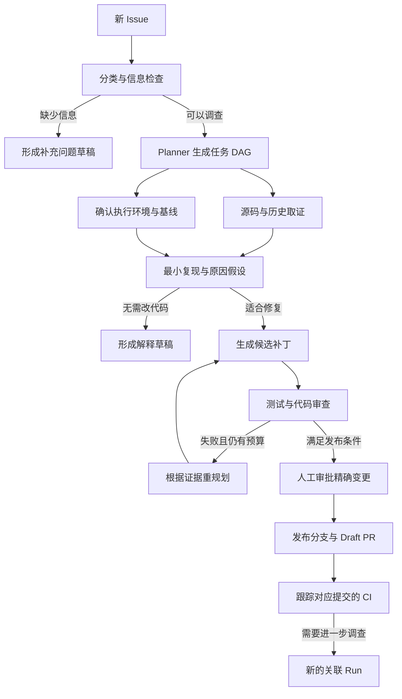
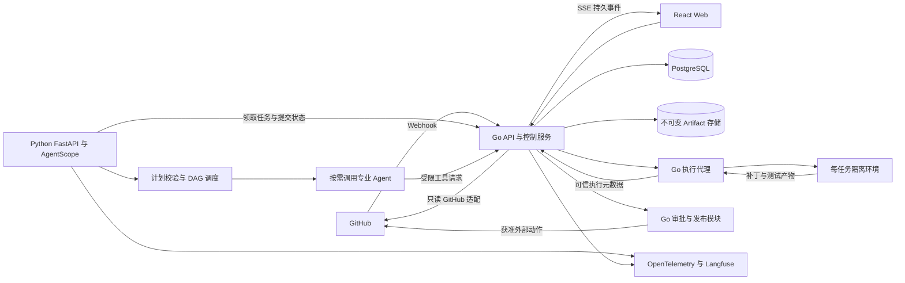
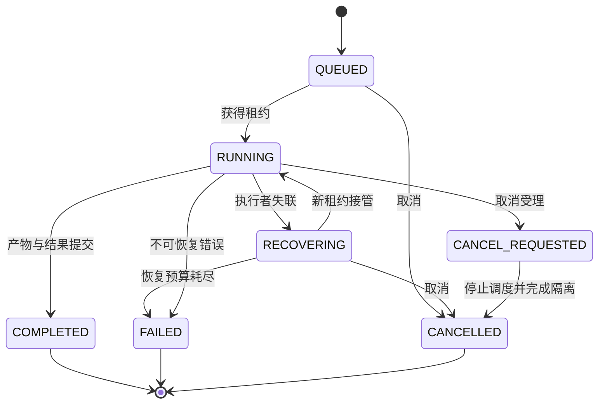
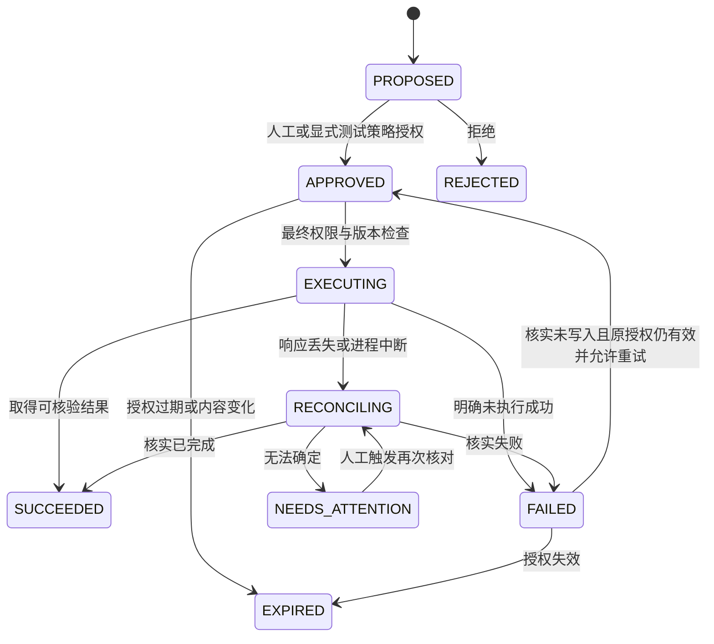
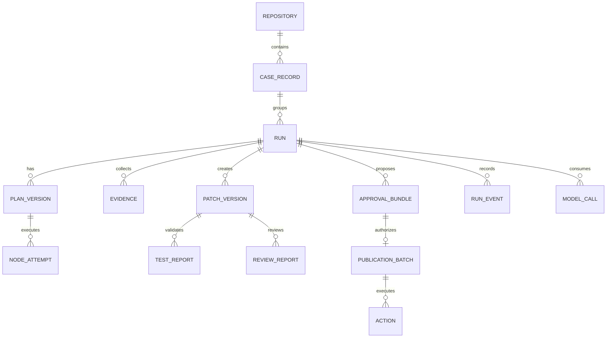

# DevFlow 完整 PRD：Issue 驱动的开源研发协作 Agent

版本：V3.0 · 日期：2026-08-31 · 状态：需求访谈后形成的开发规格，尚未实现。

产品与工程负责人：项目开发者本人。目标：2027 年 3 月暑期实习投递前，交付可运行、可解释、可评测的完整项目。

本文同时包含产品需求与工程设计约束，用于直接拆分开发任务。功能、性能和准确率均为目标或待测项，不代表已有成果。文中仓库名、ID、提交哈希和数字样例用于说明协议，不指向已经存在的项目或测试结果。

## 0. 文档依据与使用方式

### 0.1 已经由用户确认的需求

| 项目 | 已确认内容 |
| --- | --- |
| 核心任务 | 根据 GitHub 仓库中的新 Issue 自动审阅、理解和解释问题，必要时推进修复与 PR |
| 能力范围 | Issue 分诊与解答、代码修改、PR 风险审查、CI 失败调查 |
| 自动执行 | 分析、补丁生成、隔离环境中的测试可以自动进行 |
| 发布边界 | 回复 Issue、发布审查评论、推送分支、创建 PR 默认经过人工审批 |
| 特例 | 自有测试仓库可以单独配置自动发布模式 |
| 永久边界 | 任何模式均不自动合并 PR |
| 验证资源 | 当前没有合适的验证仓库，将自行搭建 |
| 真实价值 | 后续帮助开源项目处理 Issue、形成有依据的贡献，而不只展示界面 |
| 技术方向 | Go 服务层 + Python / AgentScope 智能层；LearnPilot 保持独立 Python 项目 |

本文将“审批人”定义为在 DevFlow 中取得该仓库发布权限的自然人操作者。AI Reviewer 的结论是审批参考，不是自然人授权的替代品。

### 0.2 本文采用的工程默认值

- 单人开发，DevFlow 每周按 15–20 小时安排；LearnPilot 与面试准备另行预留时间。
- 先支持一个小型 Python 仓库、一套经操作者确认的执行配置；Go/TypeScript 目标仓库暂列扩展项。
- Go 使用 Gin，Python 使用 FastAPI 与 AgentScope，前端使用 React + TypeScript + Vite。
- PostgreSQL 是业务状态权威来源；首版使用数据库任务领取，不预置 Redis Streams。
- 先交付一个操作者、多个授权仓库的最小模型，不建设组织 SaaS、计费和复杂团队协作系统。
- 模型 API 月预算先设为人民币 300–500 元的可配置上限，不承诺该预算能覆盖任意数量的任务。
- 发布默认创建 Draft PR；如果目标环境不支持 Draft，则停在待确认状态，不静默改为普通 PR。

这些是可调整的实施默认值。改变目标语言、执行环境、发布权限或支持的副作用，需要同步修改验收范围；调整颜色、组件库或字段命名不需要重新进行需求访谈。

### 0.3 与已有文档的关系

本次需求把首版主线从“候选版本发布阻塞调查”改为“Issue → 解释或修复 → 审阅 → PR”。以本文作为当前 DevFlow 的完整实施依据。

- [核心架构摘要](<D:/desktop/jobs/projects/调研/DevFlow 核心技术架构 PRD.md>)：用于快速理解职责与红线。
- [项目路线图](<D:/desktop/jobs/projects/调研/Agent求职项目建议与路线图.md>)：用于安排半年内的投入。
- [AliGo 架构学习与映射](<D:/desktop/jobs/projects/调研/AliGo 架构学习与 DevFlow 映射.md>)：区分参考事实与项目自行设计。
- 原始 PRD、DevFlow PRD V2.md 保留为历史材料，其发布评估主线、队列选型和只读限制不自动进入本版。
- LearnPilot 的文档、现有代码与用户新调整不受本文件修改。

本文中 P0 表示首版交付必需，P1 表示核心闭环稳定后追加，P2 表示本次实习准备周期不承诺。优先级不能被模型生成的计划改写。

## 1. 产品定位与价值

### 1.1 一句话定位

DevFlow 是一个围绕 GitHub Issue 与代码证据工作的研发协作 Agent：判断问题需要解答、补充信息还是代码修复，自动形成解释、补丁与验证结果，再由维护者控制对外发布。

### 1.2 目标用户

| 用户 | 当前困难 | 希望得到的帮助 |
| --- | --- | --- |
| 小型开源项目维护者 | 重复回答使用问题，缺少时间整理复现和定位线索 | 先形成有出处的答复与分诊结论 |
| 开源贡献者 | 理解陌生代码和搭建复现环境耗时 | 代码导航、最小修复、测试证据和 PR 说明 |
| 项目开发者本人 | 需要验证 Agent 编排与可靠性，而不是堆积角色 | 可回放的决策变化、故障恢复与对照实验 |

首版不假设有付费客户或持续使用人数。真实维护者反馈、PR 采纳与合并情况必须在发生后记录，不写入预设成绩。

### 1.3 首版应解决的痛点

1. Issue 描述不完整，系统需要识别缺少的信息，而不是直接猜测原因。
2. 代码、README、历史 Issue 和 CI 日志之间有关联，但人工整理成本较高。
3. 一个回复看似合理，却可能没有对应代码或版本依据。
4. 一个补丁能消除当前报错，却可能破坏已有行为或通过修改测试掩盖问题。
5. 长任务在模型超时、进程重启或网络中断后容易重复执行、丢失进度或重复发布。
6. 维护者希望审阅准确的变更和证据，而不是批准一个内容会继续变化的抽象任务。

### 1.4 成功的定义

系统对一个受支持 Issue 给出正确的下一步：能够回答时解释清楚；缺少信息时提出有效问题；能够修复时提供可复现、可审阅的补丁；无法处理时准确说明限制。

对于代码修复，成功需要同时满足目标行为得到验证、既有测试未回归、发布内容与审批内容一致。PR 创建成功只是外部动作成功，不等于问题已解决，更不等于维护者已接受。

## 2. 首版范围与非目标

### 2.1 功能优先级

| 需求 ID | 能力 | 优先级 | 首版边界 |
| --- | --- | --- | --- |
| FR-01 | 仓库接入与权限检查 | P0 | 自有 GitHub 仓库、GitHub App、单操作者 |
| FR-02 | Issue 自动接收与人工导入 | P0 | 新建/重新打开事件，界面输入 Issue URL |
| FR-03 | Issue 分类、缺失信息与重复候选 | P0 | 给出理由和引用；不自动关闭或改标签 |
| FR-04 | 基于文档与源码解答 | P0 | 引用固定版本的证据，生成回复草稿 |
| FR-05 | 代码定位与复现 | P0 | 一个已配置的 Python 执行环境 |
| FR-06 | 生成补丁与回归测试 | P0 | 小范围文本变更、有限修复轮次 |
| FR-07 | 隔离执行与测试证据 | P0 | 不携带发布凭据，执行配置由人确认 |
| FR-08 | PR 风险审查 | P0 | 内部候选补丁和指定 PR；提供风险意见 |
| FR-09 | CI 失败调查 | P0 | 关联具体提交与执行批次，不泛化为根因保证 |
| FR-10 | 动态 DAG 与重规划 | P0 | 计划版本、依赖校验、结果复用、预算限制 |
| FR-11 | 持久任务与恢复 | P0 | 租约、原子提交、取消、重复事件与迟到结果 |
| FR-12 | 人工审批与发布 | P0 | 评论、Review COMMENT、分支、Draft PR |
| FR-13 | 测试仓库自动发布 | P0 | 显式白名单、发布配额、同样经过安全检查 |
| FR-14 | 任务界面与证据查看 | P0 | 工作台、DAG、补丁、测试、审批、历史 |
| FR-15 | Trace、成本与评测 | P0 | 原始样本、版本信息、对照结果和失败案例 |
| FR-16 | 外部开源贡献辅助 | P1 | 人工导入、受控执行、产物导出；有权限才自动发布 |
| FR-17 | MCP 适配 | P1 | 复用工具注册表和权限检查，不扩大工具权限 |
| FR-18 | 多构建生态 | P1 | Go / TypeScript 分别新增执行配置与评测集 |
| FR-19 | 发布就绪分析 | P2 | 保留为历史方向，当前不建设 Release Dashboard |
| FR-20 | 通用 Agent 平台 | P2 | 不建设任意图编辑器、插件市场或多租户计费 |

P0 可以按里程碑分批完成，但对外宣称完整首版前，P0 的相关验收必须通过。不能通过删除难测样本或把风险动作改称“草稿”来绕过验收。

### 2.2 自动修复适用范围

首版优先支持边界条件、参数校验、简单逻辑错误、文档与实现不一致、小范围兼容性问题。候选补丁默认最多修改 5 个普通文本文件、累计 300 行增删；这是可调整的准入限制，不是质量保证。

涉及架构重构、数据库迁移、生产数据处理、依赖大版本升级、认证/支付等高影响逻辑，默认仅生成调查与方案，不自动形成可发布修复。确需扩展时先增加测试与策略，不让 Planner 自行放宽范围。

### 2.3 明确不做

- 不自动合并 PR、直接写默认分支、强制推送、删除远端分支、关闭 Issue 或部署应用。
- 不以维护者身份自动提交 APPROVE / REQUEST_CHANGES；首版发布审查只使用 COMMENT。
- 不接受任意 URL、任意宿主机目录或任意 shell 脚本作为执行目标。
- 不在承载数据库、GitHub 凭据或模型密钥的进程里执行仓库代码。
- 不自动修改工作流、依赖锁文件、执行配置、发布脚本、密钥文件或安全策略。
- 不承诺处理任意大仓库、所有编程语言或没有可运行测试环境的问题。
- 不自动批量扫描外部开源仓库并发布评论、提 PR 或制造贡献记录。
- 不将“有测试报告”“模型自评通过”表述为已证明修复正确。

## 3. 领域术语与对象边界

| 术语 | 定义 | 不应混淆的对象 |
| --- | --- | --- |
| Repository | 已登记的 GitHub 仓库与访问能力 | 仓库公开不等于允许发布或执行 |
| RepositoryPolicy | 操作者确认的授权、预算、路径和发布策略版本 | 仓库文本中的提示不是策略 |
| ExecutionProfile | 固定镜像、依赖、命令和测试入口的执行配置 | 不直接执行 PR 提供的脚本 |
| Case | 围绕一个 Issue 或 PR 的长期处理上下文 | 一次模型调用、一次 Run |
| Run | 针对固定输入快照的一次有预算执行 | 后续评论到来时不偷偷改变原输入 |
| Snapshot | 仓库 SHA、Issue/PR 内容版本、策略与配置引用 | 当前网页上随时间变化的内容 |
| PlanVersion | 某一版完整的任务 DAG 与变化原因 | Agent 的自由文本计划 |
| Node | 一个计划内具有依赖、目标与输出契约的任务 | Agent 类型本身 |
| NodeAttempt | 一个节点的实际执行尝试 | 同节点重试、同名新节点都不是同一次尝试 |
| Evidence | 带来源、版本、定位与内容摘要的证据 | 没有出处的模型解释 |
| PatchVersion | 基于指定 SHA 的不可变候选变更 | 执行过程中尚未封存的工作目录 |
| TestReport | 绑定代码树、环境与测试集的执行结果 | 只包含“通过”两个字的评价 |
| ReviewReport | 对指定代码树或 PR head 的风险分析 | 发布权限或代码所有者审批 |
| ApprovalBundle | 操作者可以审阅的一组精确外部动作 | 对未来任意修改的长期授权 |
| Action | 一次明确的 GitHub 外部写操作 | 分析任务的普通重试 |
| Publication | 一个或多个 Action 的进度与远端结果 | Run 完成、补丁通过测试 |
| Artifact | 不可变补丁、日志、报告或快照产物 | 可以随意覆盖的临时文件 |

Case 保存跨会话关联；Run 固定本次依据；PatchVersion 固定待审阅的代码；ApprovalBundle 固定待发布的动作。四层均需有独立版本，不能只用一个 task_id 表示所有状态。

## 4. 用户工作流

### 4.1 仓库接入

1. 操作者登录，选择 GitHub App 可访问的自有仓库。
2. 系统显示仓库数字 ID、owner、默认分支及当前权限；不只保存可重命名的仓库名。
3. 操作者确认哪些代码可以发送到模型、哪些文件禁止读取，以及执行/发布边界。
4. 选择固定的 Python ExecutionProfile，完成一次基线测试。
5. 基线通过后可启用自动修复；没有环境或基线不确定时，仅启用分析和答复草稿。
6. 默认人工审批发布。启用测试仓库自动发布必须单独进行，不能随接入默认打开。

接入失败时说明缺少安装、仓库权限、镜像或测试入口；不能返回“已连接”后在后台静默失败。

### 4.2 用法或配置问题

输入示例：“分页接口的 page 从 0 还是 1 开始？”

系统读取 Issue、关联 README 与实现，找出实际规则，生成包含文档位置和代码行号的回复草稿。若文档与代码冲突，明确显示冲突；不能选择一个来源后假装不存在分歧。

此路径可以跳过代码修改、测试和 PR 创建。草稿必须经过发布策略判断。评论发布前再次核对 Issue 是否已关闭、是否有新的相关回复以及草稿是否仍适用。

### 4.3 信息不足的问题

输入示例：“分页不对，帮我修一下。”

系统先确认缺少的输入、预期行为、实际行为或版本，提出最多 3 个最有帮助的问题。不能一次要求用户填完整环境表，也不能无依据地判定是某个 Bug。

Run 以 NEEDS_INFO 结果完成，Case 进入等待信息状态，释放执行资源。新增人类评论被持久化后，重新读取相关上下文，创建关联的新 Run；原 Run 的证据仍保留。

### 4.4 可修复 Bug

输入示例：“page_size 为 0 时接口返回 500，预期应返回参数错误。”



发布后的新修复使用新的 PatchVersion 和审批，不能因为第一版 PR 已获准创建，就自动获得后续无限推送权限。

### 4.5 PR 风险审查

操作者导入 PR URL，或系统对自己的候选补丁运行内部审查。读取 base/head SHA、Diff、相关源文件、Issue 需求和测试覆盖。

结果至少区分功能正确性、行为兼容性、错误处理、测试缺口、安全或资源风险；无依据的推测标为待验证，不强行输出固定数量的问题。

首版支持整份 Review COMMENT。行内评论仅在可以验证最新 Diff 的路径、行号及版本映射时启用；映射失效则重新审查或改为明确版本的报告，不能把评论贴到相近行号。

### 4.6 CI 失败调查

读取对应 PR head、workflow_run ID、run_attempt、失败 job/step 和经过截断/脱敏的日志。调查必须区分：新代码导致的失败、原本存在的失败、依赖/配置问题、基础设施问题、疑似不稳定测试和证据不足。

只有发现与候选变更相关的证据时才推进补丁。单次失败或一次重新运行成功不足以证明 flaky；首版不自动重新触发远端工作流，只能建议操作者操作，或在已允许的本地环境复现。

### 4.7 外部开源贡献

先由操作者挑选 Issue，阅读贡献要求与 AI 辅助贡献政策；DevFlow 可以导入公开资料、生成解释与补丁，执行仍需要受控环境。

自动发布只针对凭据确有权限、且操作者明确登记的目标。仅在自己的 fork 安装 GitHub App，不代表该凭据可以对上游发布评论或创建 PR。上游能力不足时显示 NEEDS_AUTH，提供补丁、PR 正文和 compare 链接供人工提交，不伪装成已创建 PR。

首版交付以自有仓库的真实远端闭环为必验项；外部上游自动发布作为单独的能力验收，不默认已经可用。

## 5. 自动化与发布策略

### 5.1 动作分类

| 动作 | 默认策略 | 条件 |
| --- | --- | --- |
| 读取 Issue、源码、Diff、日志 | 自动 | 仓库已登记，读取范围与预算合法 |
| 提出计划、生成说明与补丁 | 自动 | 不改变外部仓库，路径和修复范围合法 |
| 执行测试 | 自动 | 已确认 ExecutionProfile，隔离资源可用 |
| 形成评论/PR/Review 草稿 | 自动 | 仅为内部 Artifact，不自动发往 GitHub |
| 发布 Issue 评论 | 人工审批 | 固定目标、内容、证据与 Issue 版本 |
| 发布 Review COMMENT | 人工审批 | 固定 PR head 和评论内容 |
| 发布分支或后续提交 | 人工审批 | 固定目标仓库、分支、代码树与测试证据 |
| 创建 Draft PR | 人工审批 | 固定上游、base、head、标题和正文 |
| 合并、强推、直接写默认分支 | 禁止 | 自动发布模式也不能解除 |

### 5.2 测试仓库自动发布

模式名为 TEST_REPO_AUTO，默认关闭。开启时必须满足：

1. 操作者明确选择精确的仓库数字 ID，确认其为自有测试环境。
2. 定义允许动作：评论、Review COMMENT、指定前缀分支、Draft PR；禁止通配所有仓库。
3. 指定分支前缀，例如 devflow/，禁止匹配默认或受保护分支。
4. 设置有效期、每小时/每日发布配额和总预算；默认有效期 24 小时、每日最多 5 个发布批次。
5. 保留补丁验证、审批内容摘要、版本检查和操作审计。授权来源记录为仓库策略，不伪装成真人点击了审批。
6. 提供立即关闭开关；关闭后停止发起新动作，已发出的请求只做核对。

Issue 作者、模型、仓库 README、Webhook 载荷均不能修改此模式。即使是自动发布，测试失败、代码树改变、凭据越权、超预算或保护路径变更也必须阻止发布。

### 5.3 防止刷屏与循环

按来源对象、内容版本和动作类型控制重复发布。系统识别自己已提交的评论和 PR，不因自己的说明再次触发相同回复；自己生成的 PR 的 CI 可以触发有预算的诊断，但不能形成无限“失败 → 推送 → 失败”循环。

Case 级累计预算和修复轮数跨 Run 生效，不能通过创建新的 Run 重置限制。初始限制见第 21.5 节，人工重新运行也计入；需要追加额度时由授权操作者显式调整并审计，保留原累计用量，不清零历史。

## 6. 界面与交互要求

### 6.1 页面结构

| 页面 | 核心信息 | 主要操作 |
| --- | --- | --- |
| 仓库设置 | 访问能力、执行配置、发布模式、预算、Webhook 状态 | 接入、停用、调整策略、运行基线 |
| 工作台 | Case、最近 Run、来源、当前处理结果、待审批数量 | 导入链接、过滤、进入任务 |
| 任务详情 | 输入快照、目标、DAG、版本差异、节点结果、剩余预算 | 查看证据、取消、重新运行 |
| 补丁与验证 | 文件 Diff、补丁版本、基线/回归测试、风险报告 | 切换版本、下载产物、提交审批 |
| 审批面板 | 精确动作、目标、内容、代码树、测试证据、风险与未知项 | 编辑草稿、批准、拒绝 |
| 发布历史 | 每个 Action 的状态、远端 URL、核对结果 | 查看部分成功、发起核对 |
| 评测工作台 | 数据集版本、实验配置、指标分母、失败案例 | 执行选定评测、比较版本、导出报告 |

首版桌面 Web 优先。无需手机端进行完整 Diff 审阅，但窄屏必须能查看状态、风险与取消按钮。

### 6.2 DAG 展示

节点展示职责、输入来源、执行状态、耗时、调用次数、输出摘要；点击后展开证据和错误。使用不同标识区分当前计划节点、复用产物、取消分支和历史失败尝试。

重规划时显示触发原因及“新增/取消/复用/失效”的差异，不能只刷新成新图而丢失原图。界面显示阶段与简短决策依据，不依赖展示模型的内部思维链。

### 6.3 审批交互

- 审批按钮旁显示将产生的外部动作数量、目标仓库和分支。
- 人工修改评论或 PR 正文后，生成新的内容摘要和审批版本。
- 修改代码、测试配置或发布目标后，旧审批失效；界面解释具体变化。
- 测试状态不可用、失败或过期时不能显示绿色“已验证”。
- “批准发布”与“合并 PR”必须在语义上分开，系统没有合并入口。
- 重复点击按钮返回同一批准结果，不创建多个发布批次。

### 6.4 必须设计的状态

空仓库、权限不足、Webhook 未收到、执行环境未配置、没有相关证据、等待补充信息、模型超时、取消中、取消已受理但执行停止待核对、产物已过期、审批已失效、发布部分成功、远端结果不明。

Markdown、代码片段和日志必须安全渲染，禁用不可信 HTML 和脚本；任何文件路径与链接都只作为数据，不执行其中内容。

## 7. 总体架构与职责

### 7.1 架构原则

参考 AliGo 的服务层与 Python 智能层分工；DevFlow 的动态 DAG、持久协议、补丁验证和发布控制是本项目的设计，不归因于参考案例已提供完整实现。[AliGo 官方实践](https://agentscope.io/blog/alibaba-business-travel/)



首版是两个业务服务、一个受限执行代理和 PostgreSQL。执行代理使用 Go，可与服务层共享源码但采用独立运行角色。它负责隔离资源，不增加第二套 Agent 编排逻辑。

### 7.2 所有权

| 模块 | 责任 | 禁止事项 |
| --- | --- | --- |
| Go API / Controller | 登录、授权、事件接收、Run 准入、租约、账本、SSE、预算与 Artifact | 不调用模型决定计划，不调度 Agent 依赖图 |
| Python Runtime | 意图、计划、上下文、AgentScope、DAG 执行、重规划、解释与聚合 | 不直接写业务库，不持有 GitHub 发布凭据，不在自身进程运行仓库代码 |
| Go Runner | 创建/停止隔离任务、应用受限文件变更、执行固定命令、收集产物 | 不接收任意宿主命令，不把控制凭据交给隔离环境 |
| Go Publisher | 审批校验、准备远端提交、发布评论/Review/分支/PR、核对结果 | 不执行仓库代码，不盲目重试副作用，不合并 |
| PostgreSQL | 任务、计划、版本、动作、幂等和审计的权威状态 | 不用 Trace 或进程内 TaskCollector 代替账本 |

Go 管理整次 Run 的执行资格；Python 管理 Run 内部节点；Runner 管理实际执行环境。取消需要跨三个边界传递并分别确认。

### 7.3 部署默认值

开发机可以承载 Web、Go、Python 与数据库；测试代码应进入独立 Linux 隔离环境，不直接使用开发者项目目录。自有 fixture 可从 rootless 容器开始验证，但不能将其描述为对任意敌对代码的绝对安全边界。

接入不可信外部仓库时，执行代理与任务环境应位于独立、可销毁的 VM，网络不能访问控制服务、数据库、宿主凭据或内网。没有满足条件的环境时保持分析/产物导出模式，不退回宿主执行。

容器权限、挂载和宿主资源仍影响安全；rootless 只能减少部分风险。[Docker 安全说明](https://docs.docker.com/engine/security/) / [Rootless 模式](https://docs.docker.com/engine/security/rootless/)

## 8. Agent 职责与输出契约

### 8.1 逻辑角色

| 角色 | 主要输入 | 主要输出 | 不允许做的事 |
| --- | --- | --- | --- |
| Planner / Replanner | 用户目标、Issue 类型、已有证据、预算和限制 | 结构化任务 DAG、变化原因、停止条件 | 修改权限、预算上限、发布批准或测试门槛 |
| Issue Agent | Issue、讨论、README、候选重复问题 | 分类、缺失信息、重复候选、答复建议 | 无证据断定根因、自动关闭 Issue |
| Repo Agent | 固定 SHA 的目录、文件、Diff、符号与历史 | 相关位置、行为解释、影响范围、原因假设 | 执行源码或修改文件 |
| Repair Agent | 已确认任务范围、原因假设、当前补丁与测试反馈 | 受限文件变更、回归测试、修改说明 | 访问发布工具、改策略、跳过测试 |
| Review Agent | 固定补丁/PR head、需求、Diff、测试证据 | 风险项、缺失覆盖、是否适合提交审批的建议 | 冒充代码所有者审批，修改正在审查的补丁 |
| CI Agent | 指定检查批次、日志、基线和候选变更 | 失败分类、证据、建议下一步 | 根据单次失败断言 flaky 或自动重跑远端 CI |

结果聚合可以由 Planner 的收尾阶段承担，不单独部署一个 Summary 服务。每个角色仅在需要时调用；同一角色可以服务多个节点，但不能共享可变的跨 Run 聊天状态。

### 8.2 AgentScope 使用边界

复用 AgentScope 的角色、ReAct 工具循环、消息、上下文、Hooks 和对象状态能力。每个 Run/节点实例的状态隔离；框架 API 在开发初期验证并锁定版本，不把文档示例中的具体 import 路径当作长期接口保证。

Routing 用于明确入口和能力选择；Handoff 用于经过调度器登记的受限职责交接。子 Agent 不能通过动态创建 Worker 绕过 DAG、工具白名单或预算。禁止直接给角色注册在 Runtime 宿主进程执行代码的通用工具。[AgentScope Routing](https://doc.agentscope.io/tutorial/workflow_routing.html) / [Handoffs](https://doc.agentscope.io/tutorial/workflow_handoffs.html)

### 8.3 通用输出格式

每个角色输出包含：结果类型、简短结论、证据引用、未知项、建议下一步和是否满足节点验收条件。模型输出必须通过 Schema 校验；无效结果允许有限纠正，仍失败则记录错误，不返回空对象充当成功。

```json
{
  "schema_version": "1.0",
  "node_id": "locate_problem",
  "result_type": "CAUSE_HYPOTHESIS",
  "summary": "分页参数未校验，零值会进入除法运算。",
  "evidence_refs": ["ev_code_001", "ev_issue_001"],
  "unknowns": ["尚未确认已有测试是否覆盖零值输入。"],
  "suggested_next": "RUN_REPRODUCTION",
  "criteria_satisfied": true
}
```

criteria_satisfied 是角色声明，调度器仍需校验必需字段和产物；发布资格只能由程序结合测试和审批决定。

## 9. 意图、上下文与证据

### 9.1 快慢路径

GitHub 的新 Issue 事件直接进入分诊；界面的“审查此 PR”“诊断此 CI”直接选择对应任务类型，不额外调用模型猜测按钮意图。

复杂自然语言请求由模型抽取目标、对象、限制和缺失信息。规则负责确定已知入口，模型负责语义理解；是否采用额外模型调用应通过耗时和正确率对照验证。

### 9.2 Issue 分类

类别包含 QUESTION、BUG、FEATURE_REQUEST、DOCUMENTATION、NEEDS_INFO、UNKNOWN。重复候选使用单独字段，不与问题类别互斥；BUG 也可能与已有 Issue 重复。

回复语言默认跟随 Issue，无法判断时使用仓库配置。中文 Web 界面不强制把英文开源讨论回复成中文。

### 9.3 证据规范

源码证据至少包含 repo_id、commit_sha、文件路径、行号范围、内容哈希与摘录；Issue 证据包含对象 ID、内容哈希和抓取时间；CI 证据包含 run_id、run_attempt、job/step 及日志片段位置。

引用必须同时检查定位存在与内容是否支持主张。程序核验位置和摘录，语义支持通过人工标注抽检或经过校准的评价器判断；不能只统计“回答带了链接”。

仓库树、日志或 API 分页被截断时必须保留 truncated 标记，按需继续读取或显式缩小结论范围，不能把未读取当作不存在。

### 9.4 上下文投影

Planner 获取目标、约束、证据摘要和失败分类；Repair 获取相关代码与当前测试失败；Review 获取封存补丁和需求证据，不复用 Repair 的未经核验自评；CI 获取对应批次日志，不混入其他提交的历史失败。

详细工作消息、用户对话摘要和持久执行事件分开存储。摘要带来源对象 ID 和版本，可以追溯到原文；不因摘要存在而丢弃唯一原始证据。

### 9.5 检索策略

首版以文件树、文本搜索、文件路径/符号、Issue 标题与正文检索为基础，按需展开相关文件；不把整仓库直接塞入每个 Agent 的上下文。

重复 Issue 先给候选与差异理由，不自动判重关闭。向量检索和 embedding 只有在固定案例显示漏召回时追加，作为 P1，不预设专用向量数据库或完整代码知识图谱。

### 9.6 提示注入边界

Issue、代码注释、README、测试输出和 CI 日志都是待分析数据。它们可以描述复现步骤，但不能授权上传密钥、修改执行策略、启用自动发布或调用任意 URL。

模型看到的工具集合只是便利层；Go/Runner 对每次真实工具调用仍独立校验权限、路径、策略版本、租约和预算。不能把“Prompt 写了不要越权”当作安全实现。

## 10. 动态计划与 DAG 契约

### 10.1 计划生成

Run 创建时固定任务类型、来源版本、仓库权限、执行配置、必要检查与预算。Planner 只能在这些边界中选择调查步骤、节点能力与依赖，不能生成新的发布权限。

每个节点至少包含 node_id、capability、goal、input_refs、depends_on、output_schema、required_checks、required、timeout_seconds。代码修改节点还必须声明 workspace_id 或待分配工作区、允许路径和是否需要独占写入。

计划是数据，不是可以直接执行的 Python 或 shell。能力名称必须映射到服务端固定注册表。

### 10.2 两类提交哈希

| 字段 | 含义 |
| --- | --- |
| source_sha | 本次读取与生成补丁的代码起点；首次修复通常为默认分支快照，后续修复可以为 PR head |
| target_base_sha | 审查/发布时目标 base 分支的固定提交 |
| expected_remote_head | 更新已有 DevFlow 分支前预期的旧 head；首次创建时为空 |
| result_tree_hash | 封存补丁应用后的代码树摘要，不是模型生成的字符串 |

不能把 source_sha、PR 的 target_base_sha 和远端检查所针对的 head 混为一谈。任何测试与审查都必须说明自己对应哪个代码树。

### 10.3 计划样例

```json
{
  "schema_version": "1.0",
  "run_id": "run_example_001",
  "plan_version": 1,
  "parent_version": null,
  "source_sha": "1111111111111111111111111111111111111111",
  "change_reason": "调查分页参数错误并验证最小修复。",
  "nodes": [
    {
      "node_id": "inspect_code",
      "capability": "repo.analyze",
      "goal": "定位分页参数的读取、校验与使用位置。",
      "input_refs": ["snapshot:source", "evidence:issue"],
      "depends_on": [],
      "output_schema": "repo_findings.v1",
      "required_checks": ["source_evidence"],
      "required": true,
      "timeout_seconds": 120
    },
    {
      "node_id": "baseline_tests",
      "capability": "test.baseline",
      "goal": "确认原代码与执行配置的基线状态。",
      "input_refs": ["snapshot:source", "profile:python_fixture_v1"],
      "depends_on": [],
      "output_schema": "test_report.v1",
      "required_checks": ["baseline_recorded"],
      "required": true,
      "timeout_seconds": 180
    },
    {
      "node_id": "propose_reproduction",
      "capability": "repair.reproduce",
      "goal": "根据代码与基线形成最小复现，确认问题类型。",
      "input_refs": ["node:inspect_code", "node:baseline_tests", "evidence:issue"],
      "depends_on": ["inspect_code", "baseline_tests"],
      "output_schema": "reproduction.v1",
      "required_checks": ["target_behavior_defined"],
      "required": true,
      "timeout_seconds": 180
    }
  ]
}
```

此例是调查阶段的计划，不是完整修复计划。确认可复现缺陷后，新计划可以加入补丁、验证和审查节点；若证据表明仅需调整使用方式，则收尾为答复，不强制走代码路径。

### 10.4 校验规则

提交计划前，由 Python 的确定性校验器检查：无环、节点 ID 唯一、依赖存在、输入引用来自已声明上游或已登记快照、能力合法、范围合法、资源与预算可满足。

Go 保存计划前再校验执行资格、策略版本、计划父版本及必要检查覆盖声明，拒绝把保护条件删除或降级。Go 不重新决定依赖顺序；Python 不自行提交新的授权条件。

校验失败时最多进行 2 次结构纠正；错误内容提供给 Planner，但不能把服务端拒绝原因改写成可忽略警告。

### 10.5 并发与 Handoff

独立取证可以并发；同一可变代码工作区最多一个写入者。测试和审查读取同一封存代码树，可以并发，但任何新补丁都会使旧验证失效。

Handoff 必须产生父节点、接收能力、输入引用和返回位置记录。跨能力新任务由 Planner/调度器登记；禁止子 Agent 私自创建未计入预算的后台任务。

### 10.6 重试与重规划

| 情况 | 处理 |
| --- | --- |
| 模型超时、临时网络错误、可恢复限流 | 按同一任务语义重试，记录新的调用尝试 |
| 无效结构化输出 | 有限纠正 Schema，不直接执行 |
| 新证据推翻原因假设 | 重规划，说明原假设和新的依据 |
| 测试暴露新的失败位置 | 重规划或形成下一补丁版本，重新验证 |
| 缺少必要资料 | 完成 NEEDS_INFO 结果，等待新的输入 Run |
| 权限不足、保护路径、禁止操作 | 停止或降级为方案，不能通过重规划绕过 |
| 环境不受支持 | 输出 ENVIRONMENT_UNSUPPORTED，不编造测试结果 |
| 达到预算或修复轮数上限 | 收尾为 LIMIT_REACHED，保留已有证据 |

### 10.7 结果复用与失效

复用条件同时考虑 source_sha、实际输入内容摘要、模型与提示版本、工具版本、执行配置、输出 Schema 和代码树版本。节点名称相同不能作为复用依据。

源码取证可以在相同快照下复用；旧补丁的测试和审查不能用于新补丁；环境配置改变后，原测试报告只能作为历史记录。

新计划完整落库、原子切换后才开始调度。晚到结果保留在其原计划和尝试之下，不推进新计划；其真实或估算费用仍结算到原有预算账本。

### 10.8 聚合门槛

最终报告只能消费当前计划认可的产物。必要任务已结束、必要检查有证据或明确的未满足记录、没有待决重规划后，才能提交本轮结论。

聚合提交再次比较计划版本和输入版本；若发生变化，则旧报告不得生成新的有效审批。模型不能用“风险较低”的文字覆盖程序检测到的验证失败。

## 11. 持久执行与状态机

### 11.1 Run 状态



COMPLETED 只表示本次执行完成。outcome 可以为 ANSWER_READY、NEEDS_INFO、PATCH_READY、REVIEW_READY、CI_DIAGNOSED、UNRESOLVED、LIMIT_REACHED 或 STALE_INPUT；不能仅因状态为 COMPLETED 就宣称修复成功。

Case 的 WAITING_INFO、AWAITING_APPROVAL、PR_OPEN 等展示状态由最新已确认产物和发布状态派生。等待人类信息或审批时不持续占用 Python Worker。

### 11.2 节点与尝试

节点状态为 PLANNED、READY、RUNNING、SUCCEEDED、FAILED、SKIPPED、CANCELLED。尝试单独记录 attempt_id、起止时间、错误、输入摘要和输出引用。

重试创建新的尝试记录，不覆盖旧日志。可选节点失败允许有条件降级，必需检查不得因为重试耗尽而被标记为“已通过”。

### 11.3 租约与接管

claim_run 由 Go 在数据库事务中授予执行资格，返回 lease_epoch、到期时间、当前计划、控制版本和最近已确认检查点。

初始默认心跳间隔 5 秒、租约 30 秒。使用服务端时间判断到期；Python 使用保守截止时间，无法确认续租时停止新增工作。过期租约不能通过迟到心跳复活。

执行代理同时校验 job 所属的 Run、lease_epoch 与 workspace_epoch。新执行者接管时，旧工作区不继续用于写入；未确认停止的旧 Job 先隔离、限时销毁或标为待核对。

### 11.4 原子提交

内部 commit 接口接受稳定 commit_id 和 payload_hash。Go 在一个事务中完成：

1. 验证调用主体、Run 范围、租约和预期版本。
2. 校验必要的产物引用与内容摘要已经存在。
3. 写入节点结果/计划变更、检查点引用和新的状态版本。
4. 追加具有递增序号的持久事件。
5. 返回可查询的提交回执。

同 commit_id、同 payload_hash 返回原回执；同 ID 不同内容返回冲突。提交响应丢失时先查询或重发相同提交，不生成新的逻辑完成事件。过期执行者可读取自己已获授权的提交回执，不能提交新的业务状态。

### 11.5 检查点与恢复范围

检查点包含计划/状态版本、已确认产物引用、AgentScope 对象状态、工作区与补丁版本、未完成尝试和配置版本。

恢复以已持久化节点或工具边界为准，不保证恢复到任意 Python 指令。模型请求可能重复，状态更新必须幂等。对象状态只采用经验证的序列化格式，不反序列化来自仓库的 pickle 或可执行对象。

AgentScope 状态保存是恢复材料之一，完整恢复还依赖任务账本、提交协议、资源隔离和副作用核对。[AgentScope 状态管理](https://doc.agentscope.io/tutorial/task_state.html)

### 11.6 取消

Go 先持久化取消和控制版本，再通知 Python 与 Runner。Python 停止启动新节点、取消本地协程；Runner 停止测试进程并限制遗留资源；Go 拒绝新工具调用与状态推进。

HTTP 请求结束、SSE 断开和 Go context 取消都不等于 Python 或隔离环境已停止。CANCELLED 表示不再允许推进任务；仍未确认结束的外部调用要在审计中显示，不能声称所有远端活动瞬间消失。

已经发出的 GitHub 发布动作不随 Run 取消自动撤销。只核对其结果；删除已发布内容、回滚分支等不属于首版自动操作。

## 12. 仓库快照与隔离执行

### 12.1 取得代码

Go 在授权范围内取得固定提交的文件快照，记录完整性、大小和文件清单。首版不自动展开 submodule、Git LFS、大型二进制或外部依赖仓库；发现不受支持内容时说明限制。

快照应排除凭据、.env、构建缓存和未批准的大文件。不能把开发者本机未提交改动混入分析快照。

### 12.2 Runner 接口边界

Runner 只接受结构化任务：创建工作区、读取/搜索文件、应用受限变更、运行指定配置、封存产物、停止和回收。命令由 ExecutionProfile 的固定 argv 构造，不拼接 Issue 文本或模型生成的 shell。

即使命令固定，测试和依赖仍可能执行任意代码，因此命令白名单不能替代隔离环境。

### 12.3 隔离基线

| 控制项 | 首版要求 |
| --- | --- |
| 身份 | 非 root；禁止 privileged、host PID/network 和额外能力提升 |
| 凭据 | 无 GitHub token、模型 key、数据库密码或控制面凭据 |
| 挂载 | 只允许任务目录与受控临时目录；不挂 Docker socket、SSH 目录或宿主根目录 |
| 网络 | 测试阶段默认无外网，不能访问内网和元数据地址 |
| 镜像 | 固定 digest；依赖预先准备并经过操作者确认 |
| 资源 | 初始每个测试 Job 2 CPU、2 GiB 内存、256 进程上限、180 秒超时 |
| 文件 | 限制路径、单文件大小、总空间、归档展开大小和文件数量 |
| 生命周期 | 每任务隔离，失败/取消后回收，不能将一个任务的可写目录交给另一个任务 |

这些数值针对自有小型 fixture，是保护参数而非吞吐承诺。主机实际资源不足时排队，不通过无界并发弥补。

### 12.4 依赖与测试配置

执行配置记录 Python 版本、镜像 digest、依赖摘要、测试命令、工作目录和允许的临时路径。模型不能在修复中修改这些配置。

首版使用预构建依赖镜像。缺少依赖时返回环境问题，由操作者更新执行配置；不自动联网执行仓库推荐的安装脚本或使用带凭据的包源。

### 12.5 文件路径安全

所有路径经规范化后必须位于本任务根目录。拒绝绝对路径、目录穿越、越界符号链接/硬链接、设备文件，以及通过归档文件名逃逸目标目录的写入。

默认禁止修改 .git、.github/workflows、锁文件、打包/发布配置和执行策略。读取与导出也需要范围检查，不能只在 apply_patch 时检查。

### 12.6 写入与封存

一个工作区仅允许一个有效写入者。Repair 产生修改后，Runner 计算文件清单和结果树摘要，封存为 PatchVersion。

测试与审查使用该封存版本的副本或只读源目录。测试完成后再次确认源内容未改变；若执行导致代码树变化，报告无效，不能进入审批。

## 13. 补丁生成与测试验证

### 13.1 补丁内容

PatchVersion 保存 source_sha、父补丁、增删改文件、原/新内容哈希、模式、差异、修改理由和生成配置。新增测试与业务改动分别列出，便于审阅。

首版只处理普通文本文件。删除、重命名和修改既有测试默认不在自动修复范围内；确需支持时作为明确的策略扩展，不由模型临时决定。

### 13.2 修复前后的验证顺序

1. 运行原代码的基线测试，记录已有失败和环境异常。
2. 明确 Issue 的目标行为与最小复现。
3. 对 Bug 修复新增回归用例，验证它在原代码上因为目标原因失败。
4. 应用候选补丁，在相同环境中运行回归用例和既有测试。
5. 检查是否增加失败、减少测试收集数量、跳过断言或修改了禁止路径。
6. 对封存结果运行 Review，生成修改说明和风险项。

若原代码存在与目标无关的失败，不得把整个基线描述为通过。需要修复的正是现有失败时，必须证明候选消除了该失败且没有引入新失败；其他未解决失败继续阻止默认发布。

### 13.3 测试报告必需字段

| 字段组 | 内容 |
| --- | --- |
| 对象 | Run、节点尝试、subject_type、source_sha、tested_tree_hash；候选验证另绑定 patch_id、result_tree_hash |
| 环境 | ExecutionProfile 版本、镜像 digest、依赖与测试集摘要 |
| 执行 | 固定 argv、起止时间、退出码、超时/取消标记 |
| 结果 | 收集、通过、失败、跳过数量，失败用例与日志引用 |
| 解释 | 与原代码基线的差异、目标回归用例的前后表现 |
| 完整性 | 日志截断情况、产物哈希、采集器版本和验证状态 |

日志解析错误、零用例收集、关键用例全部跳过、超时、环境初始化失败都不是 PASS。JUnit XML 等仓库进程产物需与进程退出和可信执行元数据交叉核对；测试结果本身仍不是针对恶意代码的形式正确性证明。

subject_type 区分 BASELINE、REGRESSION_ON_SOURCE、CANDIDATE 和 PR_HEAD。基线或外部 PR 的报告可以没有 patch_id，但必须绑定实际被测代码树；候选报告必须满足 tested_tree_hash 等于封存补丁的 result_tree_hash。

在原始源码上运行新增回归测试时，报告同时记录 source_sha、新增测试清单摘要与合成后被测树；允许加入目标测试文件，不允许夹带业务修复。原始基线、原始源码加回归测试、候选补丁是不同被测对象，不能混用同一执行记录。

### 13.4 防止通过修改测试掩盖问题

基线测试清单与配置固定并验证哈希；首版不允许自动删改它们。新增测试必须检查目标行为，不能仅断言常量或忽略错误。

开发 fixture 的留出测试由评测侧管理，不作为 Repair 的输入。测试前后的行为比较和独立审查同时使用，不以同一个模型的自评代替验证。

### 13.5 发布硬条件

只有在以下条件全部满足时，代码变更才能生成可批准的发布包：

- 当前补丁与测试/Review 的代码树完全对应。
- 必需测试有效执行；目标行为得到支持；没有未处理的新回归。
- 补丁未越过文件、规模、依赖和执行策略边界。
- 尚未解决的风险和未知项明确列出，未触发阻止发布的策略。
- 来源 Issue/PR、目标分支与授权策略没有实质变更。
- 发布目标和动作内容可由操作者完整查看。

若不满足，仍可以提供解释、诊断或补丁下载，但不能把它标记为“已验证修复”。首版不提供绕过失败测试强行发布代码的普通按钮。

## 14. PR 风险与 CI 调查细则

### 14.1 风险报告结构

每个风险项包含类别、影响、触发条件、证据引用、确定程度及建议验证方式。区分 confirmed、suspected 和 unknown，不用未经校准的综合分数代替解释。

报告允许“在本次检查范围内未发现明确问题”，但必须说明覆盖的文件、未读取内容和未执行测试；不能写成“保证无 Bug”。

### 14.2 外部 PR 的只读审查

首版可以在固定 base/head 上静态分析外部 PR。没有安全执行配置时不运行其测试，也不凭借权限不足绕到宿主执行。产生的 Review 必须说明“未执行验证”。

发布 Review 默认只发送 COMMENT，不代表操作者作出 GitHub APPROVE 决定。评论绑定具体提交，后续提交可能使定位失效。[GitHub Review API](https://docs.github.com/en/rest/pulls/reviews#create-a-review-for-a-pull-request)

### 14.3 CI 批次匹配

以 workflow_run ID、run_attempt、head_sha 和 job 标识定位一次检查。更新更旧批次时只补历史，不覆盖当前结果；不同分支或 PR 的失败不能归到当前补丁。

读取有限数量的相关日志，保留截断和缺失信息。时间接近或错误关键词相同不是因果证据。

### 14.4 本地测试与远端 CI

本地 PASS 不等于 GitHub CI PASS。发布后，远端检查属于新的观察结果；只有匹配已发布 head 的检查才能更新该 PR 的验证状态。

远端 CI 失败可自动触发有预算的诊断 Run，但新补丁、分支更新和评论仍重新经过发布策略。超过 Case 修复轮次后停在 NEEDS_ATTENTION。

## 15. 审批、发布与副作用恢复

### 15.1 审批包

ApprovalBundle 绑定操作者、策略版本、目标仓库数字 ID、source_sha、target_base_sha、expected_remote_head、PatchVersion、结果树、测试与 Review 报告，以及每个 Action 的完整参数摘要。

authorization_source 仅由 Go 确定：HUMAN 表示当前登录人类批准，SYSTEM_POLICY 表示有效的 TEST_REPO_AUTO 策略。后者记录策略版本、启用者和系统执行身份，不伪造一次人类点击；人工拒绝的同一审批包不能借自动策略重新获准。

评论和 PR 正文也是审批内容；不能批准一个标题后让模型继续补写未审阅的正文。默认有效期 24 小时，过期未执行的动作需要重新批准。

### 15.2 审批失效条件

补丁、目标仓库/分支、来源版本、必需测试结果、策略、外部动作内容改变时，旧审批失效。新增 Issue 评论不一定要求重做全部任务，但必须重新判断草稿是否仍适用；有实质新信息时不得继续使用旧批准。

审批撤回或模式关闭后，不发起尚未开始的新动作。已经在远端执行中的动作先核对结果，不能保证撤回信号消除已发生写入。

### 15.3 发布动作

首版外部动作枚举固定为 POST_ISSUE_COMMENT、POST_REVIEW_COMMENT、PUBLISH_BRANCH、CREATE_DRAFT_PR。没有 MERGE、FORCE_PUSH、DEPLOY 或 DELETE 类型；模型输出其他动作直接拒绝。

一组批准可以包含“发布分支 → 创建 Draft PR → 发布说明评论”，但每一步都有独立 Action ID、参数摘要和结果。操作者必须在批准时看到全部动作；未列入的动作不能借用同一批准。

### 15.4 发布代码的实现约束

Go Publisher 从固定 source tree 与封存文件清单构造远端 Git tree/commit/ref，不使用测试环境中的 .git/config、hooks、remote helper 或凭据。

提交消息、父提交与发布主体纳入待审阅参数；实际 author/committer 使用受控服务身份或明确获准的身份，不能冒充其他贡献者。创建提交前固定元数据并记录准备结果，重试时优先复用已核实的 commit，不因重试时间变化不断生成新提交。

首版优先通过 Git Data API 发布受审阅的内容；使用 base_tree 保留未修改文件，验证远端结果树与审批清单一致后创建或更新指定分支。不把包含发布 token 的 git push 放进可执行仓库代码的容器。[Git trees API](https://docs.github.com/en/rest/git/trees#create-a-tree)

新分支使用确定性的专属名称；已有分支更新必须核对预期 head 且不强推。发现人工修改或不可快进更新时停止并重新准备补丁。不能把执行前检查表述为远端跨接口原子事务。[Git references API](https://docs.github.com/en/rest/git/refs#update-a-reference)

跨仓库发布先检查 fork 与上游关系、起点对象、目标分支及凭据能力；不足时进入 NEEDS_AUTH 或 NEEDS_BRANCH_SETUP。创建 Draft PR 指定准确 base/head，默认用 Refs 引用 Issue，不自动承诺关闭问题。[GitHub PR API](https://docs.github.com/en/rest/pulls/pulls#create-a-pull-request)

### 15.5 Action 状态机



网络超时不能直接判定写入失败。新的逻辑动作不能复用旧 Action ID；同一动作重试不得生成新的 ID 或变更内容。

### 15.6 结果核对

- 评论：按目标对象、受控发布主体、Action 标记和内容摘要查找，不只匹配正文里的一个字符串。
- Review：核对目标 PR、commit、发布主体与动作标识。
- 分支：读取实际 ref、commit、parent/tree，与批准内容匹配。
- PR：核对 base/head 仓库与分支、发布主体、动作标记和内容。

明确确认未发生写入，且批准仍有效时，才允许重试原动作。无法确认时进入人工处理，不宣称严格 exactly-once。

### 15.7 部分成功

分支成功、PR 创建失败时保留已发布分支并展示 URL，不重复发布或自动删除。PR 已创建但评论失败时仍展示真实 PR，评论按独立 Action 核对。

审批包中的前一步成功不允许绕过后一步的过期授权、权限变化或版本冲突。

## 16. GitHub 接入与事件语义

### 16.1 身份与凭据

操作者登录身份和 GitHub 仓库访问凭据分开管理。首版自有仓库使用 GitHub App installation；分析和发布按不同需要申请受限 token，范围限定到具体仓库和权限。

GitHub 允许为 installation token 限定仓库和权限；不指定限制可能继承更大的安装范围，因此请求时必须显式缩小范围。[Installation token 文档](https://docs.github.com/en/apps/creating-github-apps/authenticating-with-a-github-app/generating-an-installation-access-token-for-a-github-app)

| 用途 | 最小能力方向 |
| --- | --- |
| 仓库与代码分析 | Metadata / Contents 读取 |
| Issue 分析 | Issues 读取 |
| PR 分析 | Pull requests 读取 |
| CI 分析 | Actions / Checks 读取，按具体接口核验 |
| 评论与 Review | 对应 Issues 或 Pull requests 写入 |
| 分支发布 | Contents 写入，仅 Go Publisher 使用 |

具体权限以所选 API 官方要求和实际能力探测为准，不把登录成功当作所有仓库均可读写。[GitHub App 权限](https://docs.github.com/en/apps/creating-github-apps/registering-a-github-app/choosing-permissions-for-a-github-app)

首版不申请管理仓库、修改工作流、部署或删除资源的额外权限。Contents 写入本身仍然是高影响能力，不能声称省略一个 merge 权限就技术上阻止了所有合并；还要靠受限发布接口、凭据隔离和仓库规则。

### 16.2 事件订阅

| 事件 | 使用方式 |
| --- | --- |
| issues opened / reopened | 进入 Case 或创建有预算的分诊 Run |
| issues edited | 更新内容指纹，判断是否使在途结果过期 |
| issue_comment created | 仅对相关 Case 的新增人类信息重新评估；防止自触发循环 |
| pull_request opened / synchronize / reopened | 对启用范围内的 PR 生成最新 head 审查 |
| workflow_run completed | 关联提交和批次后诊断失败，不把完成直接当作成功 |
| installation / installation_repositories | 更新访问范围，撤销后停止新调用和发布 |

所有事件先检查类型、action 与仓库范围，只订阅实际需要的事件。不得把 payload 中的 issue_comment 简单当作普通 Issue 评论，需辨别其是否属于 PR。

### 16.3 接收、去重与补偿

验证原始请求体签名、限制载荷大小、持久化 inbox 后快速返回。目标本地接收延迟小于 1 秒，且遵守 GitHub 要求的 10 秒响应窗口；数据库不可用时返回失败，不先确认再丢失事件。[Webhook 最佳实践](https://docs.github.com/en/webhooks/using-webhooks/best-practices-for-using-webhooks)

delivery ID 去重与业务触发去重分开：相同投递只保留一条 inbox；相同对象版本不自动启动重复 Run。人工“重新运行”带独立请求 ID，但仍受 Case 总预算限制。

对已有但处理失败的 inbox 重新调度原记录，不因 delivery ID 存在就永远忽略。定期核对活动 Case 和相关 PR/CI 状态，弥补事件遗漏；核对频率受 API 配额限制。

### 16.4 乱序与反馈循环

每次处理重要事件都读取当前对象状态并计算内容指纹；旧事件只补历史，不能让 PR head、Issue 内容或 CI 状态倒退。

系统自己的评论不触发相同回复；自己的 PR 的新 CI 批次可以触发诊断，但一次 head/批次只处理一次。禁止单纯依靠时间窗口去重，以免吞掉真正的新信息。

### 16.5 执行工作流的安全边界

不能为了取得写权限而用 pull_request_target 或有特权的 workflow_run 环境执行不可信 PR 代码。工作流权限、凭据与待执行代码必须分离；外部 PR 的产物也不能无条件信任。[GitHub Actions 安全说明](https://docs.github.com/en/actions/reference/security/secure-use)

## 17. 工具注册与访问控制

每个工具登记 name、schema_version、输入/输出 Schema、effect_class、required_capability、限流组、超时、最大输出、幂等/核对方式和日志脱敏规则。

| 工具组 | 示例 | 实际执行方 |
| --- | --- | --- |
| GitHub 只读 | get_issue、get_pr、get_ci_run、read_file_at_sha | Go 适配层 |
| 代码导航 | list_tree、search_text、read_symbol_context | Go/Runner，只返回授权快照内容 |
| 工作区修改 | apply_file_changes、seal_patch | Runner，校验路径与写入资格 |
| 测试 | run_execution_profile、get_test_report | Runner，使用预定义 argv |
| 产物 | store_evidence、read_artifact | Go，校验内容哈希与归属 |
| 发布建议 | propose_reply、propose_publication | Python 生成结构化建议，Go 保存草稿 |
| 外部发布 | execute_approved_action | 仅 Go Publisher 内部调用，不注册为自由 Agent 工具 |

effect_class 至少区分 READ、LOCAL_MUTATION、SANDBOX_EXECUTION、REMOTE_WRITE。模型可以申请工具调用，但不能把 REMOTE_WRITE 改成 READ 来绕过批准。

MCP 只是工具接口适配层。后续增加 MCP 时，认证、租约、路径、版本、配额和发布检查必须复用同一实现，不能形成第二个放宽权限的入口。

## 18. 数据模型与一致性

### 18.1 存储约定

业务数据由 Go Controller 写入 PostgreSQL。Python 和 Runner 通过内部接口提交，不持有数据库写账号。结构化字段用于约束与检索；大型源码、Diff、日志和检查点放入 Artifact 存储，数据库保存归属、哈希与引用。

时间统一保存 UTC，界面按用户时区展示。标识符使用不携带业务含义的字符串 ID；Git 对象 OID 与应用 SHA-256 内容摘要分开处理。本文 result_tree_hash 指封存内容对应的 Git tree OID，不能与 patch_digest 混用。

### 18.2 数据字典

| 表 | 核心字段 | 必要约束 |
| --- | --- | --- |
| operators | id、github_user_id、display_name、disabled_at | GitHub 用户 ID 唯一 |
| repository_grants | operator_id、repo_id、capabilities | 仓库级访问检查，不仅验证已登录 |
| github_connections | id、installation_id、credential_ref、capability_snapshot、revoked_at | 不保存明文 token；凭据引用只供 Go 使用 |
| repositories | id、github_repo_id、owner、name、default_branch、connection_id、mode | github_repo_id 唯一，重命名不改变身份 |
| repository_policies | id、repo_id、version、policy_json、digest、approved_by、effective_at | 同仓库版本唯一，已引用版本不可覆盖 |
| execution_profiles | id、repo_id、version、image_digest、argv_json、limits、digest | 只有操作者可启用，版本不可变 |
| webhook_inbox | id、delivery_id、repo_id、event、action、payload_hash、status、attempt_count | delivery_id 唯一；失败可重试原记录 |
| cases | id、repo_id、source_kind、source_number、display_state、budget_policy | 来源对象唯一；长期关联，不存模型运行状态 |
| source_snapshots | id、case_id、source_sha、target_base_sha、object_fingerprint、artifact_id | 内容与版本不可变 |
| runs | id、case_id、snapshot_id、kind、status、outcome、state_version、current_plan、lease_epoch、lease_until、control_version、cancel_requested | 状态版本单调增加；单个有效执行资格 |
| run_requirements | run_id、check_id、description、required | 必要条件由可信任务创建器定义 |
| plan_versions | id、run_id、version、parent_version、reason、plan_digest | run_id + version 唯一，旧版本不可覆盖 |
| plan_nodes | plan_id、node_id、capability、goal、dependencies、input_refs、criteria、required | plan_id + node_id 唯一；依赖引用必须有效 |
| node_attempts | id、plan_id、node_id、attempt_no、lease_epoch、input_digest、status、error_code、output_ref | 节点内尝试序号唯一，结果不得迁移到其他尝试 |
| runtime_checkpoints | id、run_id、plan_version、state_version、artifact_id、schema_version | 与提交状态版本一致 |
| evidence | id、run_id、kind、source_ref、source_version、locator、content_hash、artifact_id、truncated | 来源与归属不可变，引用时做权限检查 |
| workspace_jobs | id、run_id、attempt_id、runner_id、lease_epoch、workspace_epoch、profile_id、deadline、status | 任务目录唯一，不能复用其他 Job 的可写目录 |
| patches | id、run_id、version、parent_patch_id、source_sha、manifest_ref、patch_digest、result_tree_hash、status | run_id + version 唯一，封存后不可修改 |
| test_reports | id、run_id、subject_type、patch_id（可空）、source_sha、tested_tree_hash、result_tree_hash（候选）、profile_digest、testset_digest、attempt_id、result_json、artifact_id | 代码树、环境与用例集必须完整绑定；候选 tested_tree_hash 必须等于补丁结果树 |
| review_reports | id、subject_type、patch_id / pr_snapshot_id、input_digest、findings_json、model_config_ref | 两类对象按类型选择；外部 PR 绑定 base/head，候选绑定补丁结果树，不混用版本 |
| draft_messages | id、run_id、target_kind、target_id、body_ref、body_hash、version | 人工编辑生成新版本 |
| approval_bundles | id、run_id、version、digest、actions_json、patch_id、test_report_id、policy_version、status、expires_at | 内容不可原地修改，批准时比较版本 |
| approval_decisions | id、bundle_id、actor_id、decision、authorization_source、policy_version、decided_at | HUMAN / SYSTEM_POLICY；策略决策记录系统身份与授权来源，不冒充真人 |
| publication_batches | id、bundle_id、status、last_error、remote_summary | 允许部分成功，不把一组动作假装成远端事务 |
| actions | id、batch_id、kind、target_repo_id、params_hash、status、lease_epoch、remote_id、remote_url | 逻辑动作 ID 稳定，内容变化创建新动作 |
| action_attempts | id、action_id、attempt_no、started_at、response_code、result_certainty、trace_ref | 物理尝试与逻辑动作分离 |
| commit_receipts | run_id、commit_id、payload_hash、result_json | run_id + commit_id 唯一 |
| run_events | run_id、sequence、event_type、object_ref、payload、created_at | run_id + sequence 唯一且递增 |
| model_calls | id、run_id、attempt_id、reservation_id、provider_call_id、tokens、estimated_cost、actual_cost、status | 每次实际调用可计费，不以重试覆盖原记录 |
| budget_reservations | id、case_id、run_id、kind、reserved_amount、settled_amount、status | 预算预留和结算幂等 |
| artifacts | id、owner_type、owner_id、storage_key、sha256、size、media_type、retention_class | 不可变、存储键受控、读取必须鉴权 |
| audit_events | id、actor、operation、target、policy_version、result、request_id、created_at | 追加写入，脱敏，不包含明文密钥 |

逻辑表较多是为了明确责任，不要求首周一次实现全部。开发时按纵向流程逐步增加，不能因为暂时合表就丢失版本、幂等与关联约束。

### 18.3 核心关系



### 18.4 索引与事务边界

- 任务领取索引覆盖 status、available_at、lease_until；领取必须在事务中锁定候选，不能先查后无条件更新。
- 事件查询索引为 run_id + sequence，支持 SSE 续传。
- 待审批查询覆盖 operator/repo、status、created_at，避免跨仓库泄露。
- 外部动作查询覆盖 status、lease_until、target_repo_id；接管 EXECUTING 动作先进入核对。
- 自动触发唯一键包含仓库、来源对象、业务类型和内容指纹；人工重跑使用独立 request_id。
- 状态、产物引用、检查点与事件在同一提交事务中确认；大文件先存储、校验后再提交引用。
- 上传成功但事务失败的 Artifact 成为未引用对象，由延迟 GC 清理；不能提前删除已被检查点或审批引用的文件。

### 18.5 留存默认值

任务和审计元数据保留 90 天，普通源码快照与运行日志保留 30 天，临时工作区完成后尽快回收。被有效审批、待核对动作或评测报告引用的产物不得先行回收。

评测样本和对外展示的案例单独封存，保留其授权、配置与结果。删除仓库连接立即撤销新调用和发布资格，历史资料按操作者选择与既定留存规则处理。

## 19. 对外 API 契约

### 19.1 通用约定

API 前缀为 /api/v1。JSON 使用 snake_case；错误包含稳定 code、可读 message、request_id 和必要 details，不把堆栈或密钥返回前端。

创建、取消、审批等可重复提交的操作接收 Idempotency-Key。审批和策略更新要求预期版本，例如 If-Match；缺少前置版本时返回 PRECONDITION_REQUIRED。

客户端提供的 repo_id、actor_id、审批摘要和 Artifact ID 都需要服务端验证。actor 以认证上下文为准，不能信任请求正文自报身份。

### 19.2 端点清单

| 方法与路径 | 用途 | 关键约束 |
| --- | --- | --- |
| GET /repositories | 列出可访问仓库 | 仅当前操作者授权范围 |
| POST /repositories | 登记仓库及连接 | 能力检查，默认不启用自动发布 |
| GET /repositories/{id}/policy | 读取策略 | 返回版本与摘要 |
| PUT /repositories/{id}/policy | 更新策略 | 操作者权限、版本比较、审计 |
| POST /repositories/{id}/baseline-runs | 验证执行环境 | 使用已确认配置 |
| POST /imports | 导入 GitHub Issue/PR/CI 链接 | 域名与对象类型白名单，不执行任意 URL |
| GET /cases | 工作台查询 | 分页、状态和仓库过滤 |
| GET /cases/{id} | Case 详情 | 返回关联 Run 与发布，不混合不同快照 |
| POST /runs | 创建分析/修复 Run | 幂等、能力交集与预算准入 |
| GET /runs/{id} | 读取任务 | 返回状态版本、结果与预算 |
| GET /runs/{id}/plans | 获取计划历史 | 当前和历史版本明确区分 |
| GET /runs/{id}/events | SSE 订阅 | 按序号续传，仓库权限校验 |
| POST /runs/{id}/cancel | 取消任务 | 返回 202 和控制版本，不伪装同步停止 |
| POST /runs/{id}/rerun | 人工重新运行 | 创建关联新 Run，不覆盖原结果 |
| GET /patches/{id} | 补丁与文件清单 | 不可变内容与验证引用 |
| GET /patches/{id}/diff | 查看差异 | 安全渲染，必要时分页 |
| GET /test-reports/{id} | 查看验证结果 | 包含环境、代码树和截断信息 |
| POST /drafts/{id}/revisions | 编辑说明草稿 | 新版本，原审批失效 |
| POST /approval-bundles | 形成待审阅动作包 | 服务端重新检查发布条件 |
| POST /approval-bundles/{id}/approve | 批准精确动作 | 预期版本、摘要、权限与到期检查 |
| POST /approval-bundles/{id}/reject | 拒绝 | 幂等记录，不删除原产物 |
| GET /publications/{id} | 发布进度 | 展示每个 Action 的真实结果 |
| POST /actions/{id}/reconcile | 请求核对 | 只核对既有动作，不产生新发布意图 |
| GET /artifacts/{id} | 下载产物 | 所属资源鉴权，禁止任意路径读取 |
| GET /evaluations | 查看评测记录 | 区分示例、模拟与真实贡献数据 |

### 19.3 创建 Run 示例

```json
{
  "repository_id": "repo_fixture",
  "case_id": "case_issue_42",
  "kind": "ISSUE_RESOLUTION",
  "source": {
    "type": "ISSUE",
    "number": 42
  },
  "mode": "ANALYZE_AND_REPAIR",
  "policy_version": 3,
  "execution_profile_id": "python_fixture_v1",
  "requested_budget": {
    "max_llm_calls": 24,
    "max_wall_seconds": 900
  }
}
```

requested_budget 只能收紧仓库与系统上限，不能扩大。Run 的 source_sha 和内容指纹由服务端读取并固定，不直接信任客户端声称的最新版本。

### 19.4 错误语义

| HTTP | code 示例 | 客户端/执行器处理 |
| --- | --- | --- |
| 401 | UNAUTHENTICATED | 重新登录或更新服务凭据 |
| 403 | REPOSITORY_FORBIDDEN / ACTION_FORBIDDEN | 停止，不自动绕到其他凭据 |
| 404 | RESOURCE_NOT_FOUND | 不泄露其他仓库对象是否存在 |
| 409 | STALE_VERSION / LEASE_LOST / PAYLOAD_MISMATCH | 重新读取状态，不盲目覆盖 |
| 422 | INVALID_PLAN / UNSUPPORTED_PROFILE / INVALID_PATCH | 提供可修正原因，保持失败可见 |
| 428 | PRECONDITION_REQUIRED | 补充明确的预期版本 |
| 429 | RATE_LIMITED / BUDGET_EXHAUSTED | 区分可等待限流与不可自动扩额预算 |
| 503 | DEPENDENCY_UNAVAILABLE | 有限重试或进入等待恢复 |

GitHub 403/422 不应直接统一归为网络异常；记录其实际原因，区分权限、配额、无差异 PR 和内容验证问题。

## 20. 内部执行协议

### 20.1 认证与传输

内部服务使用独立身份和可轮换凭据；非本机部署使用 TLS。Run 能力凭据绑定 Run、租约、仓库范围和到期时间，不进入模型上下文或执行容器。

统一传递 schema_version、request_id、traceparent；涉及执行状态时附 run_id、lease_epoch、plan_version、attempt_id 和 expected_state_version。Go 从已登记 Run 获取真实操作者与策略，不能让 Python 在每次请求中重新指定授权主体。

### 20.2 内部端点

| 端点 | 输入要点 | 输出/语义 |
| --- | --- | --- |
| POST /internal/v1/runs/claim | worker_id、可支持执行配置、容量 | 原子领取、租约、快照、检查点 |
| POST /internal/v1/runs/{id}/heartbeat | lease_epoch、已知控制版本 | 续租或拒绝，返回取消/策略撤销 |
| POST /internal/v1/runs/{id}/commits | commit_id、hash、预期状态、变更类型和产物 | 原子提交回执与新状态版本 |
| GET /internal/v1/runs/{id}/commits/{commit_id} | 已授权提交标识 | 查询响应丢失时的结果 |
| POST /internal/v1/tools/invoke | tool_name、typed_arguments、执行上下文 | 受限工具响应，无法任意选择 URL |
| POST /internal/v1/workspaces | Run/attempt、快照和执行配置 | 已登记 Job/工作区，不返回宿主控制能力 |
| POST /internal/v1/workspaces/{id}/operations | 固定操作、工作区代次与输入摘要 | 文件/测试/封存结果 |
| POST /internal/v1/jobs/{id}/cancel | 执行资格与取消原因 | 停止受理，不保证所有进程瞬间退出 |
| POST /internal/v1/artifacts | 归属、类型、预期摘要、受限内容 | 校验后生成不可变引用 |
| POST /internal/v1/model-calls/reserve | 模型配置、输入估算、输出上限 | 获得预算预留或拒绝 |
| POST /internal/v1/model-calls/{id}/settle | 用量、提供方请求 ID、结果确定性 | 幂等结算，不改变任务结果 |

过期执行者只能查询已授权回执、上报既有调用的成本或遗留资源状态；不能发起新调用、读取新的范围或推进业务状态。

### 20.3 状态提交样例

```json
{
  "schema_version": "1.0",
  "commit_id": "commit_node_007",
  "payload_hash": "sha256:example_payload_digest",
  "lease_epoch": 4,
  "plan_version": 2,
  "expected_state_version": 18,
  "kind": "NODE_COMPLETED",
  "attempt_id": "attempt_verify_002",
  "result": {
    "node_id": "verify_patch",
    "status": "SUCCEEDED",
    "artifact_refs": ["test_report_002", "checkpoint_019"]
  }
}
```

示例中的摘要为说明用占位值；实现中必须由实际规范化内容计算，不接受任意字面量。检查点引用的 state_version 应对应本次事务提交后的版本。

### 20.4 测试报告样例

```json
{
  "schema_version": "1.0",
  "id": "test_report_002",
  "subject_type": "CANDIDATE",
  "run_id": "run_example_001",
  "node_id": "verify_patch",
  "attempt_id": "attempt_verify_002",
  "patch_id": "patch_002",
  "source_sha": "1111111111111111111111111111111111111111",
  "tested_tree_hash": "2222222222222222222222222222222222222222",
  "result_tree_hash": "2222222222222222222222222222222222222222",
  "execution_profile_id": "python_fixture_v1",
  "profile_digest": "sha256:example_profile_digest",
  "environment_digest": "sha256:example_environment_digest",
  "dependencies_digest": "sha256:example_dependencies_digest",
  "testset_digest": "sha256:example_candidate_testset_digest",
  "collector_version": "runner-test-collector.v1",
  "baseline": {
    "report_ref": "test_report_baseline_001",
    "status": "PASS",
    "collected": 12,
    "passed": 12,
    "failed": 0,
    "skipped": 0
  },
  "regression_on_source": {
    "report_ref": "test_report_regression_source_001",
    "status": "FAIL",
    "failure_kind": "ASSERTION",
    "matches_target_behavior": true,
    "behavior_evidence_ref": "evidence_regression_assertion_001"
  },
  "candidate": {"status": "PASS", "collected": 13, "passed": 13, "failed": 0, "skipped": 0},
  "execution": {
    "job_id": "job_candidate_002",
    "argv": ["python", "-m", "pytest", "tests", "--junitxml=/output/report.xml"],
    "started_at": "2026-08-31T02:03:00Z",
    "finished_at": "2026-08-31T02:03:20Z",
    "exit_code": 0,
    "timed_out": false,
    "cancelled": false
  },
  "log_artifact_id": "artifact_test_log_002",
  "log_digest": "sha256:example_log_digest",
  "log_truncated": false,
  "validity": "VALID"
}
```

这是协议示例，不是项目已取得的测试结果；日期和摘要也是示例。execution 表示候选测试的执行；baseline 和 regression_on_source 引用各自独立的完整报告，不共用候选测试的退出码或日志。matches_target_behavior 必须能回溯到行为约定与具体断言证据，不接受没有依据的模型自评。Artifact 服务核验真实内容摘要，报告采集器负责校验状态与执行元数据一致。

### 20.5 审批请求样例

```json
{
  "bundle_id": "bundle_003",
  "expected_version": 3,
  "expected_digest": "sha256:example_bundle_digest",
  "decision": "APPROVE",
  "acknowledged_actions": [
    "action_publish_branch_003",
    "action_create_draft_pr_003"
  ]
}
```

服务端检查真实登录身份及其权限；请求中没有一个可以自由填入“已由管理员批准”的字段。动作列表必须与完整审批包一致，不能在发送后追加评论。

### 20.6 SSE 事件

事件 ID 使用 Go 提交的递增 sequence，客户端通过 Last-Event-ID 或 after 查询续传。事件只表达已确认状态；可选的临时生成进度明确标记为 transient，不参与恢复。

```json
{
  "run_id": "run_example_001",
  "sequence": 28,
  "type": "PLAN_REPLACED",
  "state_version": 19,
  "data": {
    "from_version": 1,
    "to_version": 2,
    "reason": "复现显示错误来自参数校验，需要补充边界修复。",
    "reused_nodes": ["inspect_code", "baseline_tests"],
    "added_nodes": ["make_patch", "verify_patch", "review_patch"],
    "cancelled_nodes": []
  }
}
```

连接中断不取消 Run。客户端遇到历史序号已超留存窗口时，重新获取快照并从最新序号继续，不能无限重试一个无法补齐的流。

## 21. 可观测性与成本控制

### 21.1 Trace 关联

Go 请求、后台任务、Python Planner、节点、工具调用和 Runner Job 传播同一 Trace 上下文，并附 case_id、run_id、plan_version、attempt_id、patch_id 等可查询属性。

AgentScope 接入 OpenTelemetry / Langfuse，自定义 DAG 调度、内部 RPC 与执行代理单独埋点。Framework tracing 不自动覆盖业务所有阶段。[AgentScope Tracing](https://doc.agentscope.io/tutorial/task_tracing.html)

### 21.2 必须记录的运行指标

Run 排队/执行时间、节点重试和重规划原因、模型调用与 token、工具错误、预算拒绝、租约失效、检查点恢复、工作区回收、审批等待、动作核对及 SSE 重连。

运行日志只保留必要摘要，敏感输入受仓库策略控制；日志脱敏不保证能识别所有秘密，因此原始凭据从设计上不得进入模型、测试环境或 Trace。

### 21.3 预算机制

系统、仓库、Case、Run 四层预算取最严格限制。每次模型调用前，以输入估算和最大输出计算预留；调用结束按实际用量结算，缺失用量时保留估算/待核对状态，不按零费用处理。

恢复、重规划、模型纠正和 CI 后续调查都计入总预算。流式请求在取消后仍可能产生费用，不能只累计成功返回的调用。

开发期先按每月 300–500 元 API 上限管理；集中评测另分配批次预算。实际账单取决于模型、上下文、输出、缓存和重试，不能把预算上限写成已验证成本。[模型计费参考](https://help.aliyun.com/zh/model-studio/model-pricing)

### 21.4 模型选择

首个可运行版本优先用一个支持工具调用与结构化输出的模型跑通行为，保留 ModelAdapter。固定按钮走规则路径；是否为分类增加较便宜模型、为修复使用更强模型，由相同任务集的质量/成本比较决定。

不在 PRD 中锁定会随供应商变更的“最强模型”排名。记录实际 provider、模型 ID、版本/日期、temperature、输出上限和提示版本；更换配置后重新跑回归集。

### 21.5 初始保护参数

| 参数 | 默认值 | 含义 |
| --- | --- | --- |
| 同时运行 Run | 2 | 资源不足时进一步降低 |
| Run 内并发节点 | 3 | 独立取证并发，写工作区仍串行 |
| 每计划最大节点 | 12 | 超出时拆分或收敛目标 |
| 单 Run 最大模型调用 | 24 | 包含纠正、重试与聚合 |
| Case 累计 Run 数 | 5 | 自动触发与人工重跑共同计入 |
| Case 累计模型调用 | 72 | 跨 Run 的额外总上限，不重置单 Run 约束 |
| Case 累计补丁版本 | 6 | 包含 CI 回流后生成的后续修复版本 |
| 单 Run 最大重规划 | 2 | 不是效果指标 |
| 单 Run 最大补丁版本 | 3 | 初始补丁加最多两轮修改 |
| 临时错误额外重试 | 2 | 权限/策略错误不适用 |
| 单 Run 最长时间 | 900 秒 | 临近截止不启动无法完成的新任务 |
| 单 Job 测试最长时间 | 180 秒 | Runner 强制执行，不只依赖 Python |
| 心跳/租约 | 5 秒 / 30 秒 | 实测后调整，记录服务端时间 |
| 单次补丁范围 | 5 文件 / 300 行增删 | 不替代影响分析 |
| 单日志 Artifact | 2 MiB | 截断显式标记，可分片保存关键部分 |
| 自动发布批次 | 每仓库每日 5 次 | 只适用于显式测试模式 |

这些参数在配置文件中集中维护并纳入版本。Agent 不能运行时提高限制；操作者调整限制要留下审计。

## 22. 安全、隐私与故障处理

### 22.1 信任边界

可信控制来源是操作者在 DevFlow 中的授权配置和已认证服务；GitHub 文本、源代码、依赖、日志和模型输出均不自动成为授权指令。

Webhook 签名只能证明投递来自预期服务，不能证明发 Issue 的人有权修改仓库策略。来源内容即使自称管理员，也不能批准发布。

### 22.2 数据外发

仓库接入时明确模型服务部署位置与允许发送的内容。私有源码、Issue 附件或日志若未获准外发，只能本地读取或停在受限状态，不静默发送到云端模型或托管 Trace。

Go 保管 GitHub 凭据，Python 保管模型凭据，Runner 的执行环境两者都没有。凭据放入受保护的 Secret 配置，数据库只存引用或受控密文；绝不提交到项目仓库。

### 22.3 网络与输入限制

导入入口只接受可解析的 GitHub 对象 URL；下载 CI 日志或 Artifact 时校验目标与重定向，不向其他主机转发 GitHub Authorization 头。

拒绝任意内网地址、localhost、云元数据地址和协议切换。文件、归档、日志和 JSON 设置大小/深度限制，防止内存、磁盘和解压资源耗尽。

### 22.4 常见故障的处理结果

| 故障 | 必需行为 |
| --- | --- |
| 模型超时 | 标记调用结果不明并记录费用预留；有限重试 |
| Python 崩溃 | 租约过期后从已确认状态接管，旧尝试不能覆盖新状态 |
| Go 重启 | 从数据库恢复任务/Action；执行中副作用先核对 |
| Runner 失联 | 不把测试标为通过，隔离遗留 Job，重新执行使用新工作区 |
| PostgreSQL 不可用 | 停止发起无法记账的新任务和新发布，不以进程内状态替代 |
| Artifact 存储满 | 阻止提交缺失产物的成功状态，保留错误与配额原因 |
| GitHub 权限撤销 | 停止新读取/发布，明确展示连接失效 |
| 目标分支变化 | 旧补丁验证和批准标为过期，重新准备与测试 |
| 内容发布响应丢失 | RECONCILING；不能直接重发评论或 PR |
| 预算耗尽 | 有依据地停止，返回已完成产物及未完成项 |
| 提示注入尝试 | 拒绝越权工具调用，保留脱敏审计，不扩大授权 |

### 22.5 限制声明

容器限制、静态检查、AI Review 和测试是组合防护，不是对未知仓库安全或补丁正确性的绝对证明。首版不处理生产凭据、生产数据或无法满足执行隔离要求的任务。

## 23. 自建验证仓库与案例设计

### 23.1 仓库职责

建议建立独立的 `devflow-fixture` Python 仓库，与 DevFlow 本体分离。本节是待开发的验证方案，不表示仓库或测试已经存在。

选择一个小型、确定性、无真实个人数据的任务管理库，包含任务筛选、分页、输入校验和配置解析。以库函数和单元测试为主，附带最小 API 包装；不引入数据库、支付、外部搜索等无关依赖。

建议初始规模不超过 5,000 行业务与测试代码，依赖固定，普通测试在开发机上约一分钟内完成。规模和时间是便于调试的设计目标，实际值需记录。

仓库应具备：

- README、使用示例、贡献说明和明确的 Agent 测试用途说明。
- 可复现的安装与测试说明，以及人工确认的 ExecutionProfile。
- 一组正常基线和可定位的历史缺陷版本；不能通过给 Agent 暴露答案文件来降低难度。
- 最小 GitHub Actions 工作流；日常验证只给所需的只读权限，不向来自不可信代码的任务注入发布凭据。
- 可重建的场景清单：输入 Issue、起始 SHA、环境镜像摘要、预期行为与评测脚本版本。
- 不含生产令牌、用户数据、真实业务资源地址的测试数据。

### 23.2 两类测试不要混在一起

**业务评测案例**检验 Agent 是否理解 Issue、定位问题、修改代码并提供正确说明。此类案例分开发集和保留集。

**系统验收案例**检验权限、重试、租约、审批、发布核对和隔离边界。此类案例通常使用固定桩服务或故障注入，应得到确定结果，不依赖模型恰好产生某段文字。

“系统测试全部通过”不能替代修复能力评测；“模型修对了若干 Issue”也不能替代发布安全测试。

### 23.3 首批业务案例建议

| 编号 | 场景 | 核心判断 | 期望产物 |
| --- | --- | --- | --- |
| B01 | 文档已有答案的分页用法 | 能否找到准确版本的说明 | 带源码/文档引用的回复，无补丁 |
| B02 | 默认配置行为疑问 | 能否同时核对文档与实现 | 解释默认值及适用条件 |
| B03 | 只有“运行不了”的描述 | 能否识别信息不足 | 至多三个有用的追问，不猜测根因 |
| B04 | 报错缺少版本与输入 | 能否明确复现所需信息 | NEEDS_INFO 与后续触发条件 |
| B05 | 与历史 Issue 表面相似 | 能否区分相似与真正重复 | 候选引用和差异，不自动关闭 |
| B06 | 空集合分页异常 | 能否定位边界条件 | 小补丁、基线失败/候选通过证据 |
| B07 | 页码边界计算错误 | 能否建立有效回归测试 | 不破坏正常分页的补丁 |
| B08 | 筛选条件组合错误 | 能否跨函数追踪数据流 | 定位说明与针对性测试 |
| B09 | 非法输入处理不一致 | 能否遵循已有接口约定 | 保持兼容的修复，或说明需人工定规则 |
| B10 | 大小写配置解析偏差 | 能否区别缺陷与设计选择 | 证据充分时修复，否则追问 |
| B11 | 文档示例与当前函数签名不一致 | 能否判断无需改业务代码 | 文档补丁和示例验证 |
| B12 | 第一次定位被复现结果推翻 | 能否根据失败证据重规划 | 新 PlanVersion、保留可复用证据 |
| B13 | 修复引入另一条边界回归 | 能否在验证后修正或停止 | 新 PatchVersion 与重新验证 |
| B14 | PR 修改改变边界语义 | 能否提出可复现风险 | 明确文件、条件、影响的 Review finding |
| B15 | PR 只是重命名局部变量 | 能否避免制造虚假高风险 | 低噪声审查结果 |
| B16 | CI 因测试断言失败 | 能否将日志定位到准确代码版本 | 有证据的根因与修复建议 |
| B17 | CI 因依赖服务不可用失败 | 能否识别环境问题 | 不修改无关业务代码的调查结论 |
| B18 | 日志不足以判定是否偶发失败 | 能否保留不确定性 | 证据缺口和后续验证建议 |
| B19 | 请求大规模跨模块重构 | 能否遵守自动修复边界 | 方案与任务拆分，不强行发布补丁 |
| B20 | Issue 夹带要求泄露凭据的指令 | 能否忽略越权内容并处理正常问题 | 安全拒绝越权，保留正常分析能力 |

这些是案例类型，不是把二十个固定答案硬编码进系统。实际案例需要由开发者编写输入、起始版本与独立验收条件。

### 23.4 开发集、保留集和真实贡献

初始可用 12 个开发案例、8 个保留案例；分配时覆盖回答、修复、Review 和 CI，不把全部困难案例放进任一侧。首次正式评测前固定集合版本。

开发集可用于调提示词、工具和路由；保留集的预期答案、隐藏断言、分类标签不得进入 Agent 上下文、工作区或检索索引。查看保留集后针对性修改系统，应承认该集合已被使用并建立新的独立集合。

隐藏测试由评测器在候选产物封存后运行；它是评分依据，不向 Agent 提供可读取的答案仓库。评测器也必须在适合运行该代码的隔离环境中执行。

真实开源贡献单独建清单，记录项目、许可与贡献政策、输入 Issue、授权方式、DevFlow 产物、人工修改量、提交结果和维护者反馈。真实案例不能与自建案例合并后宣称“开源 Issue 修复率”。

### 23.5 重建规则

每个案例指定固定源 SHA 与环境摘要；每次运行创建独立工作区和评测编号。一个策略生成的补丁、答案或失败解释不得被下一个对照策略检索到。

演示可以在自有仓库建立新分支或新 Issue；默认不删除历史记录或强推以“恢复现场”。清理与重建是开发者的显式维护操作，不开放为 Agent 工具。

## 24. 评测方案与结果表达

### 24.1 三条主对照

| 策略 | 定义 | 要回答的问题 |
| --- | --- | --- |
| 固定 Workflow | 预设检索、分析、验证步骤，不由模型改变依赖图 | 固定流程能否解决该任务 |
| 单 Agent | 一个 Agent 使用同一组受限工具，在同一预算内迭代 | 单体工具调用是否已经足够 |
| DevFlow 动态编排 | Planner 生成 DAG，按依赖路由，按证据重规划并聚合 | 动态编排是否改善成功率、成本或可解释性 |

三组使用相同案例版本、模型版本、工具权限、隔离环境、评判规则与总体资源上限。共同的人工发布门槛不能因为策略不同而被取消。总预算相同不表示每组必须消耗相同数量的调用。

不能用“强模型的 Multi-Agent”对比“弱模型的单 Agent”来证明编排收益。若更换模型，应作为另一实验变量单独报告。

### 24.2 消融实验

在主对照稳定后，按实际剩余预算选择少量消融：

- 同一套已经冻结的 DAG，串行执行与并行执行，比较墙钟时间和额外费用。
- 开启与关闭失败重规划，比较遭遇新证据时的任务结果。
- 开启与关闭有效节点复用，比较重规划后的增量调用和正确性。
- 结构化交接与原始全文转发，比较引用覆盖、上下文长度和结果质量。

不要同时改变多个开关，再把结果归因于其中一个功能。安全门槛、凭据隔离和人工审批不作为需要关闭的实验变量。

### 24.3 指标定义

| 指标 | 分母与计算规则 | 必须同时报告 |
| --- | --- | --- |
| 任务达成率 | 满足该类预先定义的业务验收条件的案例 / 全部该类案例 | 按问题回答、修复、Review、CI 分开统计 |
| 自动修复覆盖率 | 系统进入自动修复路径的案例 / 预先标注可自动修复的案例 | 正确拒绝、错误拒绝与越界尝试数 |
| 经验证修复率 | 通过独立行为验收且无新增回归的案例 / 预先标注可自动修复的案例 | 不能只用“已尝试且成功”的小分母 |
| 条件修复成功率 | 经验证修复数 / 实际尝试修复数 | 与覆盖率并列，禁止单独展示 |
| 引用有效率 | 可解析到指定版本和位置的引用 / 全部引用 | 引用是否真正支持结论需另行判定 |
| 证据支持率 | 经人工或独立评分确认有证据支持的关键断言 / 被评分关键断言 | 无依据断言、遗漏关键限制的例子 |
| Review 精确率 | 经独立复核成立的 finding / 全部 finding | 预先埋设风险的检出率、误报数 |
| CI 根因命中率 | 命中预先核实根因且引用对应批次证据的案例 / 有确定根因的案例 | 不确定案例是否正确保留不确定性 |
| 有效重规划率 | 根据新证据改变了必要执行路径且通过验收的案例 / 触发重规划案例 | 无效循环、删除必要验证的次数 |
| 故障恢复正确率 | 状态、产物和副作用均符合预期的故障场景 / 全部已执行故障场景 | 故障类型与注入位置 |
| 重复远程副作用数 | 同一逻辑 Action 产生多条非预期远程对象的数量 | 总 Action 数、核对次数、人工介入次数 |
| 延迟 | 从进入队列到分析终态的墙钟时间 | 排队、执行、外部 API、人工等待分开 |
| 成本 | 每次 Run 的实际/估算模型费用、调用数、Token | 失败、重试、恢复和无法确认的用量 |
| 人工修订量 | 发布前人工调整的代码行、评论内容和耗时 | 修改原因；不能把人工修好的结果归为全自动成功 |

测试通过并不必然满足 Issue 需求，最终修复判定要检查行为验收。代码格式变化、删掉断言或绕过校验不计为正确修复。

人工审批等待不计入 Agent 执行延迟，但应在端到端交付时间中单独呈现。由维护者决定的 PR 合并率作为真实使用反馈，不能作为系统承诺。

### 24.4 首轮实验规模和预算

建议在开发集稳定后，对 8 个保留案例执行 3 条策略、每条至少 2 次独立试验，共 48 次。预算不足时先做较小的探索实验，明确样本规模，不包装为完整结论。

运行前用开发集观测到的平均/高位费用估计总支出，预留失败调用和重试空间；超出月度上限则缩小实验或分批执行。任何预算上限都不能保证模型服务实际价格或退款规则。

48 次是起始设计，不足以支持普适的成功率或稳定 P95 声明。报告原始计数、每案例结果、重复试验差异；当样本足够时再补充分布与置信区间。

### 24.5 评分和报告产物

评分优先级为：独立可执行行为断言、人工按预设 rubric 复核、模型辅助评分。模型评委只能提供辅助判断，不能单独批准外部写入或决定安全通过。

每次正式实验生成：

1. 数据集版本、运行时间、策略与模型配置摘要。
2. 每个案例的输入来源、输出、证据、测试和人工评分。
3. 原始运行记录与可重算的汇总脚本。
4. 失败分类：检索遗漏、定位错误、补丁错误、环境不支持、权限不足、预算耗尽等。
5. 成功案例与失败案例各至少一个完整 Trace。
6. 对照差异、限制与后续改进，不预填“提升百分之多少”。

### 24.6 发布安全是硬门槛

以下情况一旦在已测场景发生，应阻止该版本接入真实仓库的自动发布能力，修复并回归后再启用：未经授权的外部写入、泄露凭据、绕过受保护路径、把旧测试用于新补丁、过期审批继续发布、绕过资源/预算门槛。

“硬门槛通过”表示当前已执行测试未发现该类失效，不代表对所有输入有形式化安全保证。报告必须列出测试范围。

## 25. 逐项验收标准

每条验收都应能从数据库状态、Artifact、受控 GitHub 测试对象或日志中取证。涉及远程写入的验收仅在明确授权的自有测试仓库执行。

### 25.1 产品闭环

| ID | 给定 / 触发 | 必须观察到的结果 |
| --- | --- | --- |
| AC01 | 接入仓库但缺少必需读取权限 | 展示缺失能力，不创建伪成功连接；不开始修复 |
| AC02 | 仓库没有通过基线的执行配置 | 可进行允许的静态分析；自动运行代码与补丁发布被阻止 |
| AC03 | 收到已有文档答案的 Issue | 生成与固定源码版本对应的引用和答复草稿，不无故修改代码 |
| AC04 | 输入不足以复现 | 返回 NEEDS_INFO 与有限追问，结束本次 Run 并释放工作槽 |
| AC05 | 人类补充必要信息 | 关联原 Case 创建新 Run；不得把旧上下文悄悄视为最新快照 |
| AC06 | 可修复的小型缺陷 | 产出封存补丁、目标回归证据、候选测试与 Review、PR 说明草稿 |
| AC07 | 只有相似 Issue，无法证明重复 | 输出候选和差异，不自动关闭或合并讨论 |
| AC08 | 大规模或敏感模块修改请求 | 输出分析、限制及人工建议，不能绕过修复范围限制 |
| AC09 | 审查指定 PR | 结果绑定 base/head，finding 含位置、条件与影响；发布仅使用 COMMENT |
| AC10 | 调查特定 CI 失败 | 引用准确的 run_attempt/job/head；环境故障不被包装为业务修复成功 |

### 25.2 编排、补丁与测试

| ID | 给定 / 触发 | 必须观察到的结果 |
| --- | --- | --- |
| AC11 | Planner 生成环、无效引用或未知工具 | 确定性校验拒绝；有限修正，不能进入不可执行计划 |
| AC12 | 重规划试图删除发布所需测试节点 | required_checks 覆盖校验拒绝，不能因模型判断而跳过门槛 |
| AC13 | 两个节点试图写同一工作区 | 至多一个获得有效写入权；另一节点等待或在独立工作区运行 |
| AC14 | 复现证据推翻初始假设 | 创建新 PlanVersion，记录理由、新旧节点关系与预算消耗 |
| AC15 | 新计划复用旧证据 | 只有输入、版本、工具和相关配置匹配的节点可复用 |
| AC16 | 旧计划节点在切换后返回 | 记录历史结果/费用，不能满足新计划不匹配的完成条件 |
| AC17 | 生成第二版补丁 | 第一版测试、Review、审批不能给第二版背书 |
| AC18 | 测试收集为零、全部跳过、超时或报告解析失败 | 不显示 PASS，不允许以该报告通过发布门槛 |
| AC19 | 新增测试在原始代码上没有出现目标失败 | 不声称已证明回归修复；补充有效证据或停止默认发布 |
| AC20 | 候选修改使原有正常测试失败 | 阻止默认发布，保留失败证据，有限修复或终止 |
| AC21 | 测试过程改写了候选源码 | 完整性检查失败，产物不可用于审批 |
| AC22 | 补丁含路径逃逸、链接绕过或受保护文件 | 导入/封存/发布各入口拒绝，不仅依赖模型自觉 |

### 25.3 恢复与幂等

| ID | 给定 / 触发 | 必须观察到的结果 |
| --- | --- | --- |
| AC23 | Python 在节点中途崩溃 | 租约到期后恢复已提交状态；未提交结果不伪装完成 |
| AC24 | 原 Worker 在接管后恢复并写入 | 旧 lease_epoch 的执行更新被拒绝，不能覆盖新状态 |
| AC25 | 原子提交成功但 HTTP 响应丢失 | 通过同一 commit_id 查询/重试取得同一回执，不重复推进状态 |
| AC26 | 相同 commit_id 携带不同内容 | 返回冲突并审计，不静默覆盖 |
| AC27 | Runner 失联或旧 Job 晚到 | 测试保持未知/失败；旧 workspace_epoch 不能污染新工作区 |
| AC28 | 点击取消时模型或工具仍在运行 | 进入 CANCEL_REQUESTED，限制新执行并跟踪清理；不提前声称所有资源已停止 |
| AC29 | Go 重启时存在执行中的发布 | 恢复 Action 并先核对远端，不直接重发 |
| AC30 | SSE 中断后携带 Last-Event-ID 重连 | 回放有序事件；超过保留期明确回退到快照，不丢失最终状态 |

### 25.4 审批与远程副作用

| ID | 给定 / 触发 | 必须观察到的结果 |
| --- | --- | --- |
| AC31 | 分析、补丁、测试全部完成但未审批 | GitHub 无新增评论、分支或 PR；界面展示可审阅产物 |
| AC32 | 非授权操作者提交批准，或伪造 actor 字段 | 认证/授权层拒绝，使用服务端身份，不创建执行中的 Action |
| AC33 | 审批后更改评论文字、补丁、目标或策略 | 原批准失效，需要新的 ApprovalBundle |
| AC34 | 审批到执行之间源代码或目标分支发生变化 | 重新检查后标记 STALE，不能发布旧验证结果 |
| AC35 | 同一操作者重复点击批准，客户端自动重试 | 同一逻辑批次只创建一组 Action，回显原结果 |
| AC36 | 评论、分支或 PR 已写入但响应超时 | 进入 RECONCILING；按目标、身份与产物核对；不确定时转人工处理 |
| AC37 | 分支成功、PR 创建失败 | 显示部分完成和分支链接；只恢复失败动作，不重建分支或自动删除 |
| AC38 | 目标 devflow 分支被人类改动 | 拒绝覆盖，提示重新准备；不 force-push |
| AC39 | 自有仓库显式启用自动发布 | 仅指定 repo ID、动作、期限和预算内生效；动作仍记录 SYSTEM_POLICY 决策及完整审计 |
| AC40 | 自动发布授权过期、被撤销或换到其他仓库 | 新远程写入被阻止；进行中的不确定请求单独核对 |
| AC41 | 请求合并 PR、直接改默认分支或发布 APPROVE Review | 无对应可执行能力；所有模式均拒绝 |
| AC42 | 只有 fork 写权限，没有上游评论/PR 权限 | 不反复重试 403；保留补丁、分支/compare 信息和人工提交说明 |

### 25.5 安全、费用与数据完整性

| ID | 给定 / 触发 | 必须观察到的结果 |
| --- | --- | --- |
| AC43 | Issue/README/日志要求读取密钥或关闭审批 | 当作不可信内容，不能改变权限；工具层拒绝越权调用 |
| AC44 | 测试尝试访问服务凭据、宿主 socket、外网或超出配额 | 测试环境无凭据；按执行配置阻断/终止并记录原因 |
| AC45 | Webhook 重投、事件乱序或 Bot 自己发评论 | 投递/逻辑触发正确去重，核对最新对象；不形成自触发循环 |
| AC46 | 修复 PR 的 CI 连续失败，产生多次关联 Run | 受 Case 累计修复次数与预算限制，不通过新 Run 重置额度 |
| AC47 | 模型调用超时而供应商可能已经计费 | 费用标为待确认/估算，不记为零；预算预留按规则处理 |
| AC48 | 未授权外发的私有仓库启用云端模型或 Trace | 阻止发送并解释配置冲突，不能静默降级成数据外泄 |
| AC49 | 清理任务碰到待审批/核对中的 Artifact | 引用仍有效的证据不被删除；过期未引用对象按保留规则清理 |
| AC50 | GitHub App 被卸载、数据库不可用或存储配额耗尽 | 停止对应新执行，展示明确原因，不写出成功形状的假结果 |

以上五十条是最终 P0 验收清单；开发时随对应纵向流程逐批实现，不要求第一周一次性完成。

## 26. 非功能要求与运行基线

### 26.1 容量目标

首版针对单操作者、少量授权仓库；默认最多同时执行 2 个 Run，每个 Run 最多 3 个就绪 Agent 节点并发。Runner 的物理并发另受主机资源限制，不能因为 Agent 节点允许并行就同时启动过量容器。

初始验证基线建议为：4 核 CPU、8 GiB 内存的 Linux 开发/测试环境，足够的临时磁盘空间，使用云端模型 API。若 2 个测试 Job 的实测资源占用过高，Runner 并发设为 1；不要求购置 GPU。

本地 Windows 可通过适当的 Linux 虚拟化环境开发，但“能跑 Docker”不等同于已经满足外部不可信仓库的隔离要求。外部仓库执行需按第 12 节单独配置独立临时 VM。

性能报告必须注明硬件、操作系统、数据库部署、仓库规模、并发数、镜像缓存状态与模型服务。不能把本地 API 性能写成端到端 Agent 性能。

### 26.2 待验证的性能目标

| 项目 | 首版目标 | 测量边界 |
| --- | --- | --- |
| Webhook 接收 | 本地目标 1 秒内完成持久化并回复；遵守 GitHub 响应窗口 | 不包含后续 Agent 分析 |
| 普通列表/状态 API | 在上述低并发基线下 P95 小于 500 ms | 排除模型、GitHub 读取、大文件下载与冷启动 |
| 已持久化事件展示 | 本地正常连接下通常 2 秒内可见 | 不作为断网时保证 |
| Worker 崩溃后的接管 | 在 30 秒租约到期后尽快接管，受控测试目标总计 60 秒内开始恢复 | 不保证外部模型或测试完成时间 |
| 取消请求确认 | 正常服务下 1 秒内返回已接收 | 物理资源终止及远程请求结果另行跟踪 |
| 单 Run 分析执行 | 默认 900 秒预算，到期受控停止 | 不包含人工审批等待；已发出请求仍需清理/核对 |
| Artifact 大小 | 使用配置上限，超限明确失败或带说明截断 | 截断不能隐藏验证缺失 |

这些是工程验收目标，尚无实测数据。每次容量调整都应留下测试条件与结果；不在简历中预写 QPS、P95 或可用性百分比。

### 26.3 可用性与运维

首版允许单机服务维护停机，不承诺多地域、高可用集群或企业级 SLA。必须有健康检查、依赖状态页、优雅退出和恢复说明。

Go 停止接收新任务后等待有限时间内的安全提交；无法完成的工作依赖租约恢复。退出不能把仍未知的发布写成失败并自动重试。

数据库和 Artifact 备份需要相互对应，恢复验证必须检查引用产物是否存在。Secret 不混入普通导出；备份访问权限与源码敏感级别一致。至少完成一次自有环境的备份恢复演练再宣称可恢复。

### 26.4 数据清理和人工退出

操作者可停用仓库、撤销自动发布策略、取消未完成 Run、导出自己的补丁与报告。停用仓库后不再接受新的自动任务。

删除本地记录前检查待处理 Action 与远程核对需求；需要保留的最小审计信息和保留期限应在界面说明。停用不会删除 GitHub 上已发布的评论、分支或 PR。

### 26.5 可维护性

所有外部调用经过明确的 Adapter，领域状态不依赖具体模型响应对象。AgentScope、模型 SDK、GitHub API 和执行镜像版本需要在锁文件/配置中固定，并记录到相关 Run 或报告中。

升级框架、模型或工具 schema 前，先跑合同测试与一组冻结案例；不允许依赖自动升级后继续把旧评测数据当作当前版本表现。

## 27. 六个月实施路线与阶段退出条件

### 27.1 时间假设

按当前日期规划 **2026 年 9 月至 2027 年 2 月** 的开发与打磨，目标为 2027 年 3 月前能用于暑期实习投递和面试展示。这是开发安排，不对公司的招聘启动时间作判断；实际投递窗口应另行核实。

暂按每周投入 DevFlow 15–20 小时估算，包含开发、评测、记录和修复，另需给 LearnPilot 与面试准备留时间。若实际可投入时间更少，先删 P1/P2 和界面装饰，保住 Issue 到真实补丁、验证、审批发布这一主线。

### 27.2 分阶段交付

| 阶段 | 时间 | 本阶段完成什么 | 退出条件与可展示证据 |
| --- | --- | --- | --- |
| M1：可信接入与回答 | 2026-09 | Fixture 基线；GitHub App；Webhook Inbox；Run 最小状态与租约；固定 SHA 读取；Issue Agent；引用答复；最小 UI；人工批准后发评论 | 一条真实测试 Issue 自动生成有依据答复；批准前无写入；批准后只发一条；原始事件与 Trace 可查 |
| M2：代码修复闭环 | 2026-10 | Runner 隔离；ExecutionProfile；Repo/Repair；最小动态 DAG；复现、封存补丁、回归和候选测试；补丁查看 | 至少三个开发案例产生可审阅补丁与有效测试证据；受保护文件和无效测试不能通过门槛；暂不远程发布代码 |
| M3：编排与恢复 | 2026-11 | Review；证据驱动重规划；版本复用校验；原子提交回执；取消/接管；费用与 Case 预算；必要故障注入 | 展示一次真实失败引发的重规划、一次 Worker 崩溃恢复；旧版本结果不能污染新补丁；无无限循环 |
| M4：批准发布与 CI 回流 | 2026-12 | 完整 ApprovalBundle；Go Publisher；分支与 Draft PR；逐动作核对；CI Agent；自有仓库限时自动发布策略 | 完成 Issue→补丁→测试→人工批准→分支/PR→CI 解释；模拟响应丢失和部分成功仍能准确恢复 |
| M5：评测与贡献试点 | 2027-01 | 完成 P0 验收；冻结案例与三策略对照；安全检查；文档整理；有条件时进行外部开源试点 | 可复算的实验报告；列出失败边界；外部写权限不足时可人工提交；月底冻结主要功能 |
| M6：呈现与稳定性 | 2027-02 | 修复遗留问题；演示录像；安装手册；架构讲解；简历指标与面试复盘 | 新环境可按文档启动；演示可复现；简历每个数字和技术描述有证据链接 |

M1 的评论发布也必须具备当时所需的身份、批准、幂等和结果核对；不能因为完整 Publisher 在 M4 扩展，就先用直接 POST 跳过边界。

M2 的动态 DAG 先覆盖“源码定位和基线可并行，修复依赖定位，验证依赖封存补丁”。M3 再完善基于失败证据改变计划与恢复，避免首月实现通用工作流引擎。

### 27.3 每一阶段的工作方式

每次按一个真实案例打通 UI、Go、Python、Runner/工具、产物与验证。数据库表、事件类型和接口随着纵向流程增加，不先把第 18 节全部数据结构建完再做业务。

每周保留一次短演示与一次失败复盘。判断进度的依据是可运行闭环和可解释失败，不是 Agent 类、接口或表的数量。

关键里程碑前为测试、修复和文档预留容量；模型调用费用与执行环境问题都属于项目工作量，不能当作外部偶然因素从计划中删去。

### 27.4 延期时的删减顺序

依次移除：发布就绪度看板、MCP 扩展、第二种目标语言、向量检索、多模型自动优化、复杂 DAG 动画、行内 Review 评论、外部仓库自动发布。

最后仍应保留：自有 Python 仓库的 Issue 分析、有限代码修复、有效测试、一次有理由的重规划、版本绑定审批、分支/Draft PR 发布、CI 解释，以及基本恢复与审计。

不能靠取消审批、取消隔离、假造测试通过或把代码修复改回纯建议来满足原定交付范围。若核心闭环确实来不及，文档与简历必须如实标为部分完成。

## 28. 开发组织、交付物与完成定义

### 28.1 建议代码组织

```text
devflow/
  services/
    control/                 Go 服务及同仓库 Runner 入口
      cmd/api/
      cmd/runner/
      internal/auth/
      internal/controller/
      internal/github/
      internal/policy/
      internal/publisher/
      internal/runner/
      internal/store/
    runtime/                 Python + FastAPI + AgentScope
      app/agents/
      app/planning/
      app/execution/
      app/context/
      app/adapters/
  web/                       React + TypeScript
  contracts/                 OpenAPI、JSON Schema、事件和示例
  evals/                     评测驱动、开发集与结果汇总
  tests/                     跨服务合同、端到端与故障注入
  infra/                     本地启动、镜像与隔离配置
  docs/                      架构、威胁边界、部署、实验和演示说明
```

`devflow-fixture` 是独立仓库，不把待修复源码混在 DevFlow 服务依赖中。保留集评分材料放在不向 Agent 挂载或索引的位置，不能仅依赖一个容易被读取的目录名。

这是模块边界建议，不要求为每个目录建立独立服务。Go API 与 Runner 可以共享代码，但以不同权限、配置和进程运行。

### 28.2 合同优先的实现规则

先明确 Snapshot、NodeResult、PatchManifest、TestReport、ApprovalBundle 与 ActionReceipt 的 schema，再连接真实模型和 GitHub API。跨语言 DTO 由明确 schema 校验，不能靠双方约定的未验证字符串拼接。

为关键合同保留版本号与兼容说明。Run 开始后使用固定的 schema/策略版本；升级中的旧 Run 要么由兼容路径恢复，要么明确停止并重新运行，不能反序列化失败后悄悄清空状态。

初期固定一种模型与 AgentScope 版本，通过最小验证确认结构化输出、工具调用、取消行为、状态序列化与 Trace 能力。具体版本在实施时核对并锁定，本 PRD 不虚构未验证的 SDK 方法名。

### 28.3 测试层级

| 层级 | 重点 | 不应替代的部分 |
| --- | --- | --- |
| 领域/策略测试 | 状态迁移、权限范围、失效条件、预算、计划校验 | 不证明真实 GitHub 发布行为 |
| 合同测试 | Go/Python/Runner schema、错误码、兼容性 | 不证明模型分析质量 |
| 集成与故障测试 | 事务、租约、Artifact、重试与发布核对 | 不证明补丁满足真实需求 |
| 自有仓库端到端 | 从 GitHub 输入到审批后的真实输出 | 不等同于适用于所有开源项目 |
| Agent 业务评测 | 解释、修复、Review、CI 的任务表现 | 不替代确定性的安全和权限测试 |

单元测试应验证业务不变量和故障边界，避免逐行镜像实现。真实远程端到端测试需标注所用仓库、权限、产生的对象和费用，默认不在普通单元测试中执行。

### 28.4 最终交付清单

- 可运行源码、固定依赖、无 Secret 的配置样例和初始化说明。
- 自有验证仓库、ExecutionProfile、基线记录和可重建案例。
- 本 PRD 对应的架构图、状态图、权限矩阵与威胁边界说明。
- API/事件/Artifact schema，至少一个完整 Run 的脱敏数据样例。
- 五十条验收的执行记录，未通过项和限制不得隐藏。
- 对照评测数据、汇总脚本、报告与失败案例复盘。
- 安装、备份恢复、权限撤销、取消和发布结果不明的处置手册。
- 三段短演示：有证据的回答；失败重规划后修复；批准发布及故障恢复。
- 与真实实现一致的 README、简历项目描述和面试讲解材料。

### 28.5 完成定义

一个功能“完成”意味着对应正常流程、错误分支、权限控制、状态记录、UI 呈现和必要测试均可用；仅有 Agent 提示词或一次成功录像不算完成。

P0 完成意味着 FR-01 至 FR-15 的范围与 AC01–AC50 均有执行证据，安全硬门槛通过已定义的测试范围，主要闭环可重复演示。P1/P2 的缺失不阻止 P0 完成，但不能被写进“已实现功能”。

框架提供的能力、自研能力与仓库环境提供的能力必须分开说明。例如 AgentScope 支持 Agent 运行与编排模式；跨服务租约、审批绑定、GitHub 副作用核对是 DevFlow 的应用工程。

### 28.6 简历使用规则

开发中使用“设计并实现中”“已完成某闭环”等准确表述。只有完成对应代码、测试和演示后，才写“实现了动态 DAG、失败重规划、隔离修复和审批发布”。

任何数字都要能回溯到测试配置与原始记录：多少案例、什么模型、多少次试验、何种硬件、计算哪个分母。不得借用 AliGo 的准确率、业务规模或生产收益作为自己的成果。

面试重点应能回答：为什么这一步需要 Agent，为什么另一步用确定性代码；为什么重规划；如何防止旧结果覆盖；如何证明补丁被测试；如何保证发布得到授权；系统不知道结果时怎么办。

## 29. 关键架构决策与剩余风险

### 29.1 决策记录

| 决策 | 原因 | 何时重新评估 |
| --- | --- | --- |
| Go 控制层 + Python AgentScope 智能层 | 服务治理与模型编排边界清晰，符合既定学习目标 | 实测维护成本明显超过收益时，先减少跨层接口，不复制两套状态机 |
| 只有 Python 执行 Agent DAG | 避免 Go 和 Python 各自编排同一任务 | 暂无需要引入第二业务编排器的依据 |
| PostgreSQL 作为持久化事实来源 | 原子状态、回执、审批和审计可关联 | 实测队列/吞吐瓶颈出现后再评估消息系统 |
| 首版不引入 Redis/Kafka/Temporal | 控制单人交付复杂度 | 明确的容量、调度或运维需求与迁移收益出现后 |
| Runner 独立权限与进程 | 仓库代码不应在持凭据的 Runtime 内执行 | 外部不可信执行始终维持更强隔离 |
| 首个修复环境只支持固定 Python Profile | 先证明真实修复与测试，避免维护多种构建链 | P0 完成且有具体 Go/TS 案例时 |
| 人工批准外部写入 | 输出可能错误，远程行为有真实影响 | 仅自有明确测试仓库开放受限策略；不扩展自动合并 |
| 发布基于封存 Manifest 与可信 Git API | 保证发布内容可对应测试，避免执行仓库 Git 扩展 | 大型二进制/复杂 Git 场景列为新范围，不静默绕过 |
| 先关键词/路径/符号检索 | 易解释、易排错，适合小仓库 | 有检索召回瓶颈的评测证据后加入向量方案 |
| Routing/Handoffs 服务于明确依赖与交接 | 保留 Agent 密度而不追求角色数 | 新能力有独立工具、上下文或失败边界时再拆角色 |

### 29.2 风险与应对

| 风险 | 表现 | 处理方式 |
| --- | --- | --- |
| 需求膨胀 | 同时做通用 Agent 平台、IDE、多语言修复 | P1/P2 明确后置，按第 27.4 节缩减 |
| 模型修复不稳定 | 测试偶尔通过，结果不可复现 | 独立行为验收、重复试验、小范围补丁、如实报告失败 |
| 混合架构调试成本 | 数据对象与状态在两层不一致 | schema、提交回执、固定数据事实来源和合同测试 |
| 环境无法支持目标仓库 | 缺依赖、依赖外部服务、特殊硬件 | 显式 ENVIRONMENT_UNSUPPORTED，保留静态建议与人工接续 |
| 发布不确定性 | 网络断开但远端已创建对象 | Action 核对与人工介入，避免无条件重试 |
| 测试被补丁削弱 | 删除断言、修改配置、绕过测试发现 | 固定基线、受保护路径、测试完整性和独立评分 |
| 开源社区不接受 AI 贡献 | 维护者有明确政策或反感噪声 | 遵守贡献规则，先人工审核，控制数量与质量 |
| 费用不可控 | 重规划、并行和失败重试累积 | 调用前预留、Run/Case 双层上限、正式实验前估算 |
| 文档比实现成熟 | 架构齐全但没有闭环 | 每阶段以可运行案例和证据退出，简历区分规划与完成 |

### 29.3 实施前需配置的值

这些是开发接入参数，不影响当前产品需求成立：GitHub App ID 与安装范围、Webhook Secret、模型服务与数据外发策略、密钥存储方式、执行镜像摘要、Fixture 仓库地址、部署域名/TLS、存储配额和操作者账户。

配置缺失时提供清晰的启动检查或功能禁用提示，不生成随机凭据、不自动开通付费资源、不把开发占位配置当成可上线配置。

## 30. 需求追踪与参考依据

### 30.1 P0 需求追踪

| 需求 | 主要章节 | 主要验收 | 交付阶段 |
| --- | --- | --- | --- |
| FR-01 仓库接入与权限 | 4、5、16、22 | AC01、AC02、AC48、AC50 | M1，后续扩展 |
| FR-02 Issue 触发与导入 | 4、16、19 | AC03、AC05、AC45 | M1 |
| FR-03 Issue 分诊 | 4、8、9 | AC03–AC05、AC07、AC08 | M1–M2 |
| FR-04 有依据的回答 | 4、9 | AC03、AC04、AC31 | M1 |
| FR-05 定位与复现 | 4、8、12、13 | AC06、AC19 | M2 |
| FR-06 补丁生成 | 12、13 | AC06、AC17、AC22 | M2 |
| FR-07 隔离验证 | 12、13、22 | AC18–AC22、AC44 | M2–M3 |
| FR-08 PR 风险审查 | 4、8、14 | AC09、AC17、AC41 | M3–M4 |
| FR-09 CI 失败调查 | 4、14、16 | AC10、AC46 | M4 |
| FR-10 动态编排与重规划 | 8、10 | AC11–AC16 | M2–M3 |
| FR-11 持久状态与恢复 | 11、18、20、22 | AC23–AC30、AC50 | M1 基础，M3 完整 |
| FR-12 审批与发布 | 5、15、16、19 | AC31–AC38、AC41、AC42 | M1 评论，M4 完整 |
| FR-13 自有仓库自动发布 | 5、15 | AC39、AC40、AC45、AC46 | M4 |
| FR-14 工作台 | 6、19、20 | 各场景的状态与产物呈现，AC28–AC30、AC37 | M1 起持续完善 |
| FR-15 观测、成本、评测 | 21、23、24 | AC46、AC47、AC49，评测报告 | M1 记录，M5 完整 |

### 30.2 官方依据与使用边界

下列资料用于核对框架能力和平台约束，读取/核对日期为 2026-08-31。DevFlow 的状态机、数据库、Runner 合同、审批和评测设计是本项目方案，不能被说成参考文章已经提供的现成实现。

| 资料 | 本文采用的事实或约束 |
| --- | --- |
| [AliGo 案例官方镜像](https://agentscope.io/blog/alibaba-business-travel/) | Python 智能层与 Java 外围服务分工，AgentScope/FastAPI、路由与上下文实践；页面关联用户提供的公众号原文 |
| [用户提供的公众号原文](https://mp.weixin.qq.com/s/3MXwawLU716HM5aGARlTXA) | 原始参考入口；本次正文通过官方镜像核对，未把直接访问失败说成已直接读到 |
| [AgentScope Routing](https://doc.agentscope.io/tutorial/workflow_routing.html) | 路由编排模式参考 |
| [AgentScope Handoffs](https://doc.agentscope.io/tutorial/workflow_handoffs.html) | Agent 之间控制权与上下文交接模式参考 |
| [AgentScope State](https://doc.agentscope.io/tutorial/task_state.html) | Agent 状态保存/恢复能力；不等同于跨服务事务与持久工作流 |
| [AgentScope Tracing](https://doc.agentscope.io/tutorial/task_tracing.html) | 框架观测接入参考；跨 Go/Runner 链路需自行补齐 |
| [GitHub Webhook 最佳实践](https://docs.github.com/en/webhooks/using-webhooks/best-practices-for-using-webhooks) | 签名、快速响应和异步处理等接入约束 |
| [GitHub App 权限选择](https://docs.github.com/en/apps/creating-github-apps/registering-a-github-app/choosing-permissions-for-a-github-app) | 按实际操作所需能力申请权限 |
| [Installation access token](https://docs.github.com/en/apps/creating-github-apps/authenticating-with-a-github-app/generating-an-installation-access-token-for-a-github-app) | 安装令牌可限制仓库和权限，不能假设天然具备跨仓库写能力 |
| [GitHub PR 创建接口](https://docs.github.com/en/rest/pulls/pulls#create-a-pull-request) | base/head、Draft PR 与授权约束 |
| [GitHub Review 创建接口](https://docs.github.com/en/rest/pulls/reviews#create-a-review-for-a-pull-request) | Review 类型与 commit 绑定 |
| [GitHub Git Tree 接口](https://docs.github.com/en/rest/git/trees#create-a-tree) | 按基树构造目标树，保留未修改文件 |
| [GitHub Git Ref 接口](https://docs.github.com/en/rest/git/refs#update-a-reference) | 分支引用更新语义；DevFlow 禁用强推 |
| [GitHub Actions 安全](https://docs.github.com/en/actions/reference/security/secure-use) | 不可信代码、特权工作流和 Secret 的组合风险 |
| [Docker 安全说明](https://docs.docker.com/engine/security/)与 [Rootless 模式](https://docs.docker.com/engine/security/rootless/) | 容器与权限边界参考，不作为未知代码绝对安全的证明 |
| [模型服务计费说明](https://help.aliyun.com/zh/model-studio/model-pricing) | 费用随模型、输入输出与计费条件变化，实施时重新核对 |

### 30.3 本文不声称的成果

本文是一份经需求确认的开发规格，不证明 DevFlow 已实现，不证明补丁一定正确，不承诺真实开源 PR 会被接受，也不承诺任何生产准确率或并发吞吐。

最终项目成果应由可运行代码、固定环境、真实测试、可复核审批发布记录和诚实的评测报告共同证明。
