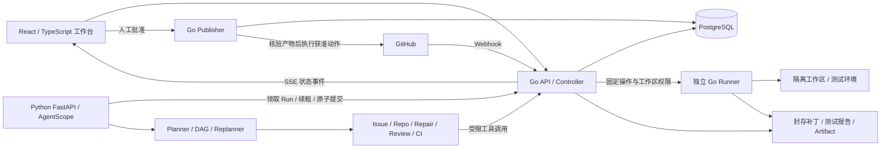

# DevFlow 核心技术架构 PRD

版本：V0.3，2026-08-31。本文是架构摘要；完整需求、接口和验收以 [DevFlow 完整 PRD V3.0](<D:/desktop/jobs/projects/调研/DevFlow 完整 PRD.md>) 为准。项目尚未实现，不把设计写成既有成果。

**当前主线：GitHub Issue → 有依据的解答或隔离修复 → 测试与风险审查 → 人工批准 → 发布分支与 Draft PR → CI 失败调查。采用 Go 服务层 + Python / AgentScope 智能层。**

[原 PRD](<D:/desktop/jobs/projects/调研/DevFlow AI 研发协同与交付 Agent PRD.md>) 与 V2 文档保留为历史参考。此前“候选版本发布阻塞调查、只读分析、仅创建跟踪 Issue”的范围已被本轮需求取代。

## 1. 产品范围与自动化边界

DevFlow 为授权仓库分析新 Issue，判断是已有答案、信息不足、缺陷、功能需求还是需要人工决策。必要时在隔离环境中实际修改代码，生成测试报告、审查结论和 PR 说明。PR 风险审查和 CI 失败调查既可作为修复闭环中的步骤，也可由明确目标单独触发。

| 操作 | 默认行为 |
| --- | --- |
| 检索、定位、分析和生成草稿 | 自动，受仓库权限与数据外发策略约束 |
| 修改工作区、生成补丁、运行测试 | 自动，使用经过批准的隔离执行配置 |
| 回复 Issue、发布 Review COMMENT | 人工审阅目标和内容后执行 |
| 发布分支/提交、创建 Draft PR | 人工审阅固定补丁与测试后执行 |
| 自有测试仓库自动发布 | 默认关闭；按具体 repo ID、动作、期限和预算单独开启 |
| 合并、强推、直接写默认分支、部署 | 所有模式均不提供 |

审批人是仓库的授权人类操作者；AI Reviewer 不能代替人工批准。发布的是获准版本；任何内容、代码、策略或目标变化都可能使批准失效。

首个修复目标是自建 Python 验证仓库，补丁默认最多 5 个普通文本文件、300 行变更。敏感模块、大规模重构、依赖/工作流修改、文件删除和重命名不进入默认自动修复范围。外部开源仓库先验证权限和隔离条件；只有 fork 权限不能推导出拥有上游写权限。

## 2. 架构与单一职责

分层参考 [AliGo 官方实践](https://agentscope.io/blog/alibaba-business-travel/)，具体适配与事实边界见 [架构学习与映射](<D:/desktop/jobs/projects/调研/AliGo 架构学习与 DevFlow 映射.md>)。跨进程持久执行、补丁验证与审批恢复是 DevFlow 的应用设计。

首版为两个业务服务、一个受限 Runner 进程以及 PostgreSQL/Artifact 存储。Go API、Publisher 和 Runner 可共享同一 Go 代码库，但 Runner 以独立权限运行；不为每个 Agent 部署微服务。

| 边界 | 负责 | 不负责 |
| --- | --- | --- |
| Go Controller | 鉴权、Webhook、Run 准入/租约、持久状态、预算、工具策略、SSE | 不生成智能计划，不另建 Agent DAG 调度器 |
| Python Runtime | AgentScope、意图/规划/上下文、DAG 校验与有界执行、重规划和聚合 | 不直写业务数据库，不持 GitHub 发布凭据，不在本进程执行仓库代码 |
| Go Runner | 固定接口的工作区、修改/封存、测试和资源清理 | 不做智能规划，不把任意 Shell 开放给 Agent |
| Go Publisher | 审批校验、分支/评论/PR 写入及结果核对 | 不执行仓库 Git hooks 或测试，不接受模型自行批准 |
| PostgreSQL / Artifact | 状态账本与不可变证据 | Trace 或内存消息不代替业务事实 |

Go 调度整次 Run 的执行资格；Python 调度 Run 内的 Agent 节点；Runner 只执行获准 Job。这三层不能各自维护互相竞争的业务计划。

## 3. Agent 密度来自决策

| 角色/模块 | 判断与输出 |
| --- | --- |
| Planner / Replanner | 选择回答、追问、调查或修复路径；生成 DAG，按新证据改变计划 |
| Issue Agent | 分类、重复候选、缺失信息和有引用的答复 |
| Repo Agent | 定位源码、调用关系和复现线索 |
| Repair Agent | 提议受限修改与有意义的回归测试 |
| Review Agent | 审查固定版本补丁，指出条件、影响与证据 |
| CI Agent | 解释准确批次的日志，区分业务失败、环境问题和未知原因 |
| Aggregator | 消费当前有效证据，合成结论、限制和 PR 说明；可由 Planner 收尾阶段承担 |
| 确定性执行器 | 依赖、权限、并发、版本、重试、预算和完成门槛 |

明确 Webhook/按钮目标走规则入口，不为每一步额外调用一次意图模型。角色可使用 AgentScope Routing/Handoffs，但新的跨角色任务必须进入受控计划；Handoff 本身不等于动态 DAG。

AgentScope 提供 Agent、工具循环、消息、状态与观测能力。应用需补齐计划版本、租约隔离、提交回执、审批与远程写入核对。[状态能力参考](https://doc.agentscope.io/tutorial/task_state.html)

## 4. DAG、重规划与恢复

计划声明节点目标、输入引用、依赖、能力、输出 schema、必要检查与预算。Python 先验证无环、引用有效、权限范围和检查覆盖；Go 对状态提交验证身份、租约、版本和发布必要条件，不能由 Planner 删除必需验证。

独立只读节点可并行；同一可变工作区只有一个写者。测试和 Review 针对封存版本使用独立副本。重试处理暂时性故障；重规划处理假设被推翻或新证据；权限不足、环境不支持和预算耗尽应明确停止。

复用必须匹配源快照、输入、工具/模型/提示配置及适用的代码树。计划原子切换，旧尝试迟到结果只留历史与费用，不能推进新计划。聚合也绑定当前版本。

Go 保存 Run、PlanVersion、NodeAttempt、Checkpoint、Evidence、Patch、TestReport、ApprovalBundle、Action 和事件。Python 使用 5 秒心跳、30 秒租约的初始参数，提交携带单调递增 lease_epoch；过期执行者不能复活。

结果、检查点、事件与状态在一次事务提交，稳定 commit_id 支持回执核对。响应丢失不能导致重复推进。恢复在已提交边界发生，不承诺恢复任意 Python 指令。

取消分“已受理”和“执行已停止”；Go context 不会自动跨进程停止 Python 或 Runner。等待补充信息、人工审批时释放 Worker，后续用 Case 关联新 Run 或独立 Action。

## 5. 隔离、补丁和发布证据

自有验证仓库先采用受限 Linux 容器：非 root、无发布/模型凭据、无宿主 socket、固定环境、测试阶段禁网、CPU/内存/进程/超时限制。外部不可信仓库需独立临时 VM 等额外隔离；不能声称 rootless 容器绝对安全。

仓库文本、Issue、日志和模型输出不具备授权能力。路径逃逸、符号链接绕过、受保护文件和任意命令在工具层阻止，不能只写进提示词。Python Runtime 不注册可在宿主执行任意代码的工具。

每版补丁封存 Manifest 与 result_tree_hash，记录 source_sha、target_base_sha 和 expected_remote_head。测试、Review、批准和发布绑定同一版。生成新补丁后重新验证。

缺陷修复验证包括原始基线、目标回归失败证据、候选行为通过、原有测试无新增失败及 Review。零测试、全部跳过、超时和未知结果不能算通过；独立行为验收避免“测试绿了但问题没解决”。

Go Publisher 从封存 Manifest 通过 Git Data API 构建提交与分支，核对目标树和远程分支状态；不用不可信工作区的 Git 配置/扩展。不强推，不直接改默认分支。

## 6. 审批与远程动作

ApprovalBundle 绑定操作者、仓库/策略版本、目标、源/基线/分支状态、补丁/测试/Review 以及全部拟发布内容；默认有效期 24 小时。执行前再检查授权和版本，不以 UI 曾经显示“已批准”代替校验。

Action 仅包含 Issue 评论、Review COMMENT、发布分支、创建 Draft PR。一个批准批次可包含多个明确动作，每个动作单独记录尝试与回执；分支成功、PR 失败显示部分完成，不回滚成“什么都没发生”。

发布响应丢失进入核对：评论匹配受控作者、目标和标记/内容；分支匹配引用与提交/树；PR 匹配 base/head 与动作标记。不能确认则交人工，不宣称跨系统 exactly-once。

自有测试仓库自动发布使用独立受限策略，仍需验证、版本检查、预算和审计。任何模式均不自动合并。外部开源目标权限不足时输出补丁、PR 说明和人工接续信息。

## 7. 界面、观测与评测

工作台展示 Case/Run、DAG 版本、节点状态、源码证据、补丁、基线/回归/候选测试、审批与发布记录。未知、部分完成、过期和取消清理中是明确状态。只展示简短决策依据与证据，不依赖暴露内部思维链。

AgentScope/Go 通过 OpenTelemetry 与 Langfuse 关联 run_id、计划、节点、Runner 和 Action；自定义边界补埋点。状态事件经数据库提交后供 SSE 续传，Trace 不参与状态恢复。[Tracing 参考](https://doc.agentscope.io/tutorial/task_tracing.html)

首批 20 个业务案例建议分 12 个开发、8 个保留，另有 50 条系统/产品验收。用固定 Workflow、单 Agent、动态编排做同模型、同权限、同预算对照；单独比较同一 DAG 串行和并行。

报告正确回答、经验证修复率及覆盖率、Review/CI 质量、恢复正确性、重复副作用、费用、延迟和人工改动量。不给尚未测量的指标填成果数字。

## 8. 实施顺序与删减

2026 年 9 月：Fixture、可信接入、引用回答和批准评论；10 月：隔离复现、动态 DAG、补丁与测试；11 月：Review、失败重规划和恢复；12 月：批准分支/Draft PR 与 CI 回流；2027 年 1 月：完整验收、对照实验和贡献试点；2 月：稳定性、简历与演示。

先实现纵向闭环，不先建设全部数据库表或通用编排平台。Redis/Kafka、MCP、向量检索、多语言构建、复杂看板和发布就绪度后置。若延期，删除扩展功能，不删用户明确需要的隔离修复、测试和批准发布主线。

完整功能清单、JSON 合同、数据字典、异常处理和逐条验收见 [完整 PRD](<D:/desktop/jobs/projects/调研/DevFlow 完整 PRD.md>)。
