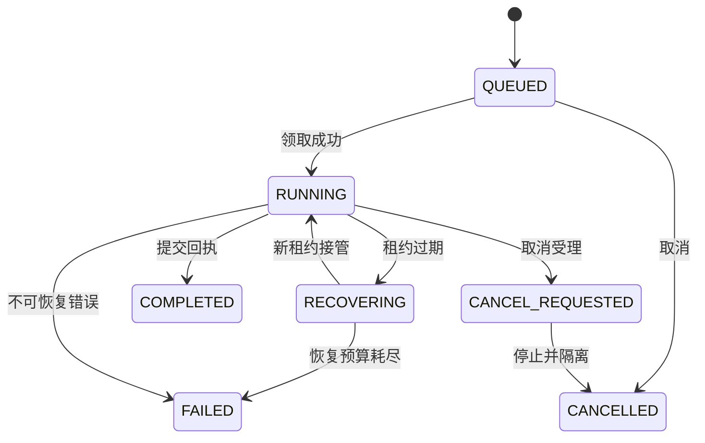
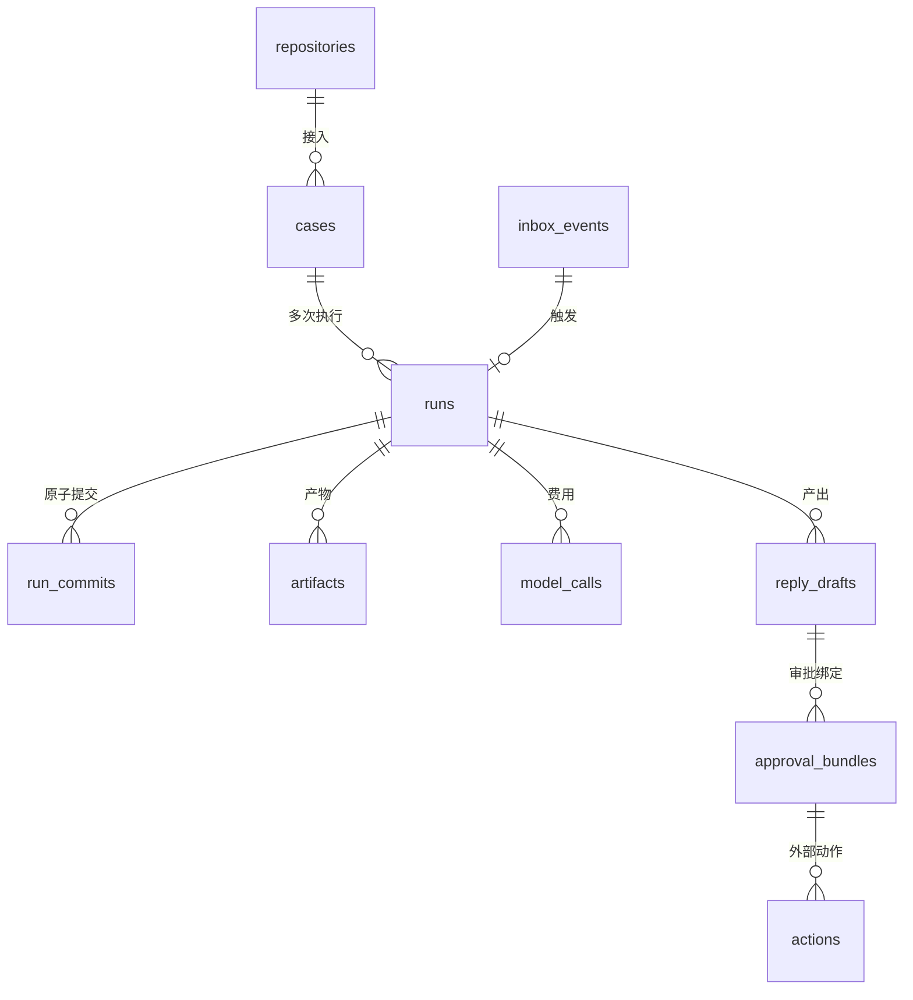

# Phase 1 Data Model: M1 主线竖切

**Date**: 2026-09-01 | 依据 [spec.md](./spec.md) Key Entities 与 PRD §3/§11/§15/§18 收窄到 M1 最小集。
约定（PRD §18.1）：时间一律 UTC；标识符为无业务含义字符串 ID；Git OID 与内容摘要（SHA-256）分开；
大内容存 Artifact 目录（content-addressable），表内只存引用与哈希。业务数据仅 Go 写入。

## 实体与表

### operators — 操作者

| 字段 | 类型 | 约束 |
| --- | --- | --- |
| id | text PK | 无业务含义 ID |
| github_user_id | bigint | 唯一 |
| display_name | text | |
| is_admin | boolean | M1 恒 true（单操作者） |
| created_at | timestamptz | |

### repositories — 已接入仓库（spec: Repository）

| 字段 | 类型 | 约束 |
| --- | --- | --- |
| id | text PK | |
| repo_numeric_id | bigint | 唯一；以数字 ID 为准，不依赖可改名 |
| owner / name | text | 联合唯一 |
| default_branch | text | |
| installation_id | bigint | GitHub App 安装 |
| capabilities | jsonb | 实测能力快照（issues_read/issues_write/contents_read） |
| policy_version | text | 引用 RepositoryPolicy 版本 |
| status | text | `active` / `disabled` |
| created_at / updated_at | timestamptz | |

接入失败（能力缺失）不落 `active`（spec FR-1、AC01）。

### inbox_events — 原始事件（spec: InboxEvent）

| 字段 | 类型 | 约束 |
| --- | --- | --- |
| id | text PK | |
| delivery_id | text | **唯一**（投递去重，AC45） |
| event_type / action | text | `issues` / `opened` 等 |
| repo_numeric_id | bigint | 范围外仓库记录后忽略 |
| payload | jsonb | 原始载荷 |
| signature_valid | boolean | HMAC 校验结果 |
| process_status | text | `received` / `deduplicated` / `ignored` / `processed` / `failed` |
| run_id | text FK→runs | 业务触发的 Run（业务去重：同对象版本不重复建 Run） |
| received_at / processed_at | timestamptz | received_at 索引 |

### cases — 案例上下文（spec: Case）

| 字段 | 类型 | 约束 |
| --- | --- | --- |
| id | text PK | |
| repo_id | text FK→repositories | |
| issue_number / issue_id | bigint | 联合唯一（repo 内唯一） |
| title | text | 首次快照标题 |
| display_state | text | 派生态：`analyzing` / `waiting_info` / `awaiting_approval` / `replied` / `closed` |
| created_at / updated_at | timestamptz | |

### runs — 一次有预算执行（spec: Run）

| 字段 | 类型 | 约束 |
| --- | --- | --- |
| id | text PK | |
| case_id | text FK→cases | |
| trigger_event_id | text FK→inbox_events | 输入溯源 |
| input_snapshot | jsonb | **固定快照**：issue 内容版本、仓库 head SHA、策略版本（FR-3） |
| status | text | 状态机见下 |
| outcome | text | `ANSWER_READY` / `NEEDS_INFO` / `UNRESOLVED` / `LIMIT_REACHED` / `STALE_INPUT`（PRD §11.1 M1 子集） |
| lease_owner | text | 领取者 worker ID |
| lease_epoch | bigint | 从 0 单调递增（AC24 防僵尸写回） |
| lease_expires_at | timestamptz | 服务端时间判断 |
| model_calls_used / max_model_calls | int | 预算护栏（默认 24） |
| error | text | |
| created_at / started_at / finished_at | timestamptz | |

**领取索引**：`CREATE INDEX ON runs (status) WHERE status IN ('QUEUED','RECOVERING')`；
领取 SQL：`SELECT ... FROM runs WHERE status IN ('QUEUED','RECOVERING') ORDER BY created_at FOR UPDATE SKIP LOCKED LIMIT 1`，
领取即 `UPDATE status='RUNNING', lease_owner=$worker, lease_epoch=lease_epoch+1, lease_expires_at=now()+30s`。
心跳：`UPDATE runs SET lease_expires_at=now()+30s WHERE id=$1 AND lease_owner=$2 AND lease_epoch=$3`，
影响行数为 0 即租约已失效，执行方必须停止新增工作（PRD §11.3）。

**Run 状态机（M1 子集，源自 PRD §11.1）**：

### run_commits — 原子提交回执（协议表，AC23–AC26）

| 字段 | 类型 | 约束 |
| --- | --- | --- |
| run_id / commit_id | text | **联合 PK**（同 commit_id 幂等） |
| payload_hash | text | 同 ID 不同 hash → 409 冲突（AC26） |
| lease_epoch | bigint | 过期执行者不能提交新状态（AC24） |
| stage | text | M1 固定 `issue-analysis` |
| result | jsonb | 结构化 NodeResult（schema：run-commit.schema.json） |
| seq | bigint | Run 内递增事件序号（PRD §11.4） |
| created_at | timestamptz | |

### artifacts — 不可变产物

| 字段 | 类型 | 约束 |
| --- | --- | --- |
| id | text PK | |
| run_id | text FK→runs | |
| kind | text | `reply_draft` / `evidence_pack` / `raw_model_io` |
| content_digest | text | sha256，唯一键（content-addressable 文件名） |
| size_bytes | int | |
| schema_version | text | |
| created_at | timestamptz | |

### reply_drafts — 答复草稿（spec: ReplyDraft）

| 字段 | 类型 | 约束 |
| --- | --- | --- |
| id | text PK | |
| run_id | text FK→runs | |
| artifact_id | text FK→artifacts | 正文全文 |
| conclusion | text | `ANSWER_READY` / `NEEDS_INFO` |
| body_digest | text | 草稿内容摘要（审批绑定键） |
| evidence | jsonb | 引用列表：`{source_type, path, line_start, line_end, sha, quote_digest}`（AC03） |
| needs_info_questions | jsonb | ≤3 个追问（AC04） |
| status | text | `current` / `superseded` |
| created_at | timestamptz | |

### approval_bundles — 审批包（spec: ApprovalBundle；PRD §15.1–15.2）

| 字段 | 类型 | 约束 |
| --- | --- | --- |
| id | text PK | |
| case_id | text FK→cases | |
| draft_id | text FK→reply_drafts | |
| action_type | text | M1 仅 `POST_ISSUE_COMMENT` |
| target | jsonb | `{repo_numeric_id, issue_number}` 精确目标（AC32） |
| content_digest | text | = draft body_digest（AC33：任一变化即失效） |
| status | text | 状态机见下 |
| expires_at | timestamptz | created_at + 24h（PRD §15.2） |
| approved_by / approved_at | text / timestamptz | 服务端认证身份（AC32） |
| idempotency_key | text | 唯一；重复点击返回原结果（AC35） |
| created_at | timestamptz | |

**状态机**：`PENDING → APPROVED → EXECUTING → EXECUTED`；
`PENDING → REJECTED`；`PENDING/APPROVED → EXPIRED`（过 expires_at 或内容/目标变化）。
发布执行前重核：Issue 未关闭、无新相关回复、草稿仍适用，否则标 `EXPIRED` 并说明（FR-8、AC34 精神）。

### actions — 外部动作实例（spec: Action）

| 字段 | 类型 | 约束 |
| --- | --- | --- |
| id | text PK | |
| bundle_id | text FK→approval_bundles | |
| type | text | `POST_ISSUE_COMMENT` |
| status | text | `PENDING → EXECUTING → (RECONCILING) → SUCCEEDED / FAILED / UNCERTAIN`（AC36） |
| remote_comment_id | bigint | 核对锚点 |
| remote_url | text | 评论链接 |
| receipt | jsonb | action-receipt.schema.json |
| attempts | int | 不盲目重发；UNCERTAIN 只核对 |
| created_at / executed_at / reconciled_at | timestamptz | |

### model_calls — 模型调用与费用（FR-10，AC47）

| 字段 | 类型 | 约束 |
| --- | --- | --- |
| id | text PK | |
| run_id | text FK→runs | |
| provider / model | text | `dashscope` / `qwen-plus` |
| input_tokens / output_tokens | bigint | |
| cost_cny | numeric | 估算值 |
| cost_status | text | `estimated` / `confirmed`；超时未确认不得记零（AC47） |
| trace_id | text | 关联 Trace |
| created_at | timestamptz | |

## 关系总览

## 明确推迟的表（不预先建，PRD §27.3）

plan_versions / nodes / node_attempts（M2 动态 DAG）、test_reports / patch_versions（M2）、
action_outbox 与逐动作核对扩展（M4）、webhook 补偿调度表（M1 用 inbox_events 重扫即可）、
session/多操作者与角色（首版单操作者）。
